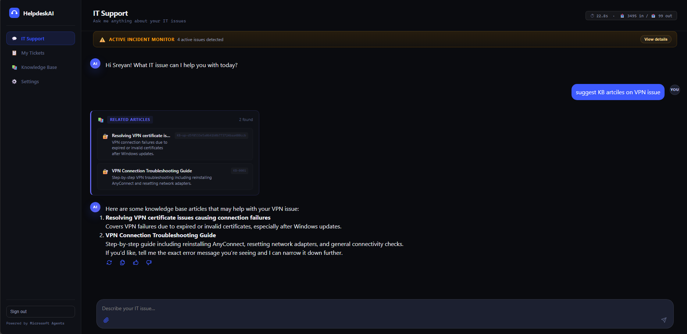
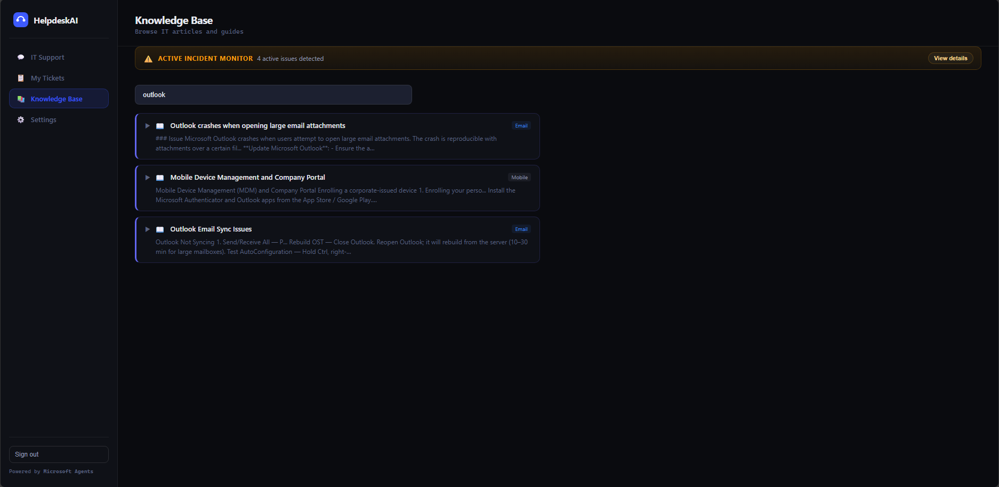
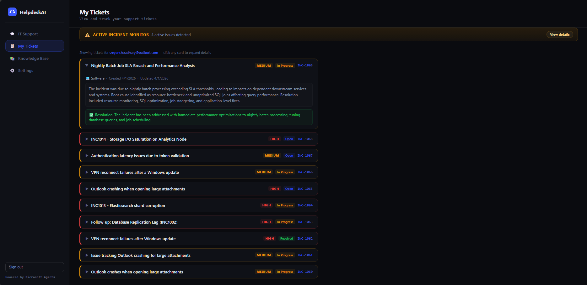
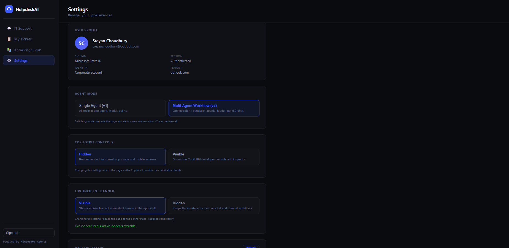
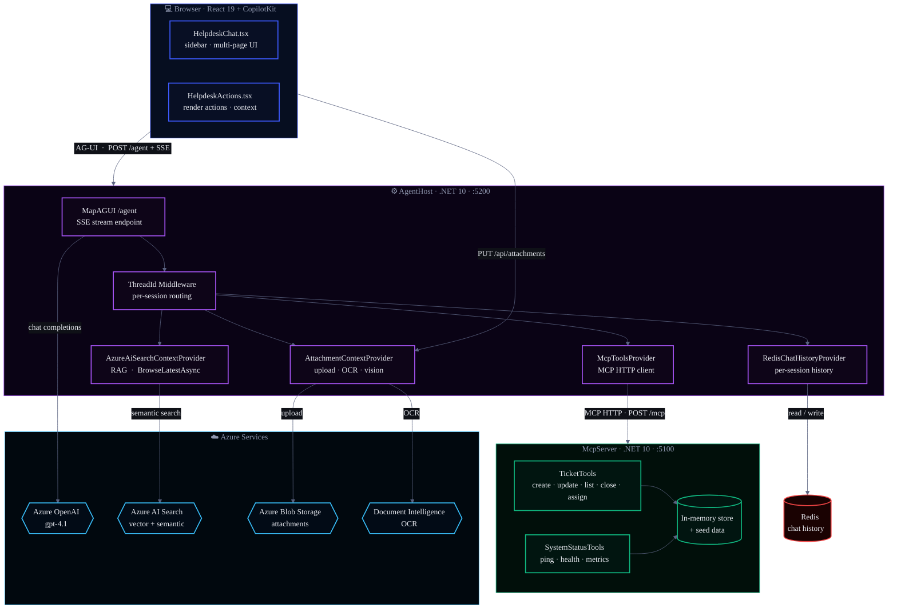

# HelpdeskAI

An AI-powered IT helpdesk assistant built on **.NET 10**, **React 19**, and the **AG-UI protocol**. The agent answers IT questions, searches a knowledge base (RAG via Azure AI Search), manages support tickets, and processes file attachments (PDFs, DOCX, images) — all streamed in real time to the browser via Server-Sent Events.

<table>
  <tr>
    <td></td>
    <td></td>
  </tr>
  <tr>
    <td></td>
    <td></td>
  </tr>
</table>

---


## Configuration & Environment Setup

### Local Development
- Uses `appsettings.json` (or `appsettings.Development.json`) for backend services and `.env.local` for the frontend.
- Example (do not use real secrets in code):
  - `src/HelpdeskAI.AgentHost/appsettings.json`:
    - `"AzureOpenAI:ApiKey": "<YOUR_AZURE_OPENAI_API_KEY>"`
    - `"AzureAISearch:ApiKey": "<YOUR_AZURE_AI_SEARCH_API_KEY>"`
    - `"ConnectionStrings:Redis": "localhost:6379"`
    - `"McpServer:Endpoint": "http://localhost:5100/mcp"`
  - `src/HelpdeskAI.Frontend/.env.local`:
    - `MCP_URL=http://localhost:5100/mcp`
- To override settings, create `appsettings.Development.json` or set environment variables locally.

### Azure Deployment
- Secrets and connection strings are injected via Azure App Service/Container App settings or Azure Key Vault.
- Example (do not use real secrets in code):
  - `"AzureOpenAI:ApiKey": "<YOUR_AZURE_OPENAI_API_KEY_FROM_AZURE>"`
  - `"AzureAISearch:ApiKey": "<YOUR_AZURE_AI_SEARCH_API_KEY_FROM_AZURE>"`
  - `"ConnectionStrings:Redis": "<YOUR_AZURE_REDIS_CONNECTION_STRING>"`
  - `"McpServer:Endpoint": "<YOUR_MCP_SERVER_URL>"`
- See `infra/README.md` for provisioning and secret management.

### Switching Environments
- Local: Use `.env.local` and local `appsettings.json`.
- Azure: Use Azure Portal or Bicep deployment to set environment variables and secrets.

---

## Table of Contents

### Getting Started
1. [Architecture](#architecture) — System design and component overview
2. [Quick Start](#quick-start) — Get running in 5–10 minutes
   - [Provision Azure Resources](#1-provision-azure-resources-recommended)
   - [Manual Setup](#2-manual-azure-setup)
3. [Prerequisites](#prerequisites) — Required tools and accounts

### Deployment & Setup
4. [Option A — Provision + Run Locally](#option-a--provision-azure-resources--run-locally-recommended) — Automated setup (recommended)
5. [Option B — Manual Setup](#option-b--run-locally-with-manual-azure-configuration) — Manual configuration
6. [Prerequisites (Detailed)](#prerequisites) — Tool versions and Azure requirements

### Development
7. [Projects](#projects) — Project structure and port mapping
8. [Component Guides](#component-guides) — Backend, frontend, and MCP server guides
9. [Configuration Reference](#configuration-reference) — `appsettings.Development.json` explained

### Using the System
10. [Demo Prompts](#demo-prompts) — Curated prompts to explore all capabilities
    - [Context Awareness](#-context-awareness-usecopilotreadable)
    - [Generative UI](#-generative-ui-usecopyilotaction)
    - [RAG Retrieval](#-rag-retrieval-azureaisearchcontextprovider)
    - [Multi-Step Chaining](#-multi-step-chaining)
    - [Tips for Demos](#tips-for-demos)
11. [Seed Data Reference](#seed-data-reference) — Incidents and tickets

### Advanced
12. [Key Technologies](#key-technologies) — Stacks and frameworks
13. [Azure AI Search Setup](#azure-ai-search-setup) — Manual KB index creation
14. [API Endpoints](#api-endpoints) — AgentHost and McpServer endpoints
15. [MCP Tools](#mcp-tools) — Tool descriptions and examples
16. [Learn More](#learn-more) — External resources

### Troubleshooting
17. [Troubleshooting](#troubleshooting) — Common issues and fixes

---

## Architecture



---

## Quick Start

### 1. Provision Azure Resources (Recommended)

```bash
cd infra
.\deploy.ps1 -ResourceGroupName "rg-helpdeskai" -Location "swedencentral"
```

This provisions Azure OpenAI + AI Search and generates `appsettings.Development.json`.

Then run services locally:
```bash
# Terminal 1
cd src/HelpdeskAI.McpServer && dotnet run

# Terminal 2  
cd src/HelpdeskAI.AgentHost && dotnet run

# Terminal 3
cd src/HelpdeskAI.Frontend && npm install && npm run dev
```

Open http://localhost:3000

### 2. Manual Azure Setup

Create `src/HelpdeskAI.AgentHost/appsettings.Development.json`:
```json
{
  "AzureOpenAI": {
    "Endpoint": "https://<your-resource>.openai.azure.com/",
    "ApiKey": "<your-key>",
    "ChatDeployment": "gpt-4.1"
  },
  "AzureAISearch": {
    "Endpoint": "",
    "ApiKey": "",
    "IndexName": "helpdesk-kb",
    "TopK": 3
  },
  "McpServer": {
    "Endpoint": "http://localhost:5100/mcp"
  },
  "Conversation": {
    "SummarisationThreshold": 20,
    "TailMessagesToKeep": 6,
    "ThreadTtl": "30.00:00:00"
  }
}
```

Then run services (same as above).

---

## Prerequisites

| Tool | Version | Purpose |
|------|---------|---------|
| **.NET SDK** | 10.0+ | Backend (.NET 10 projects) |
| **Node.js** | 22 LTS | Frontend (React + Next.js) |
| **Azure CLI** | Latest | Cloud deployment only |
| **Bicep CLI** | Latest | Cloud deployment only |

**Optional:**
- **Docker** — if deploying infrastructure to Azure
- **PowerShell 7+** — recommended for Windows deploy script

### Azure Prerequisites (if deploying to cloud)

- Active **Azure subscription** with permission to create resources and assign RBAC roles
- **Azure OpenAI** resource with `gpt-4.1` or `gpt-4o` deployment (or request access at https://aka.ms/oai/access)

---

## Option A — Provision Azure Resources + Run Locally (Recommended)

See [infra/README.md](infra/README.md) for full deployment guide.

**TL;DR:**
```bash
cd infra
az login
.\deploy.ps1 -ResourceGroupName "rg-helpdeskai" -Location "swedencentral"
```

This provisions:
- Azure OpenAI (gpt-4.1)
- Azure AI Search (Basic tier)
- Generated `appsettings.Development.json` with credentials

Takes 5-10 minutes. Then run the three services locally (see **Quick Start**).

---

## Projects

| Project | Port | Role | Startup |
|---------|------|------|---------|
| **HelpdeskAI.Mcp­Server** | 5100 | MCP tool server (tickets, system status) | `dotnet run` in `src/HelpdeskAI.McpServer/` |
| **HelpdeskAI.Agent­Host** | 5200 | AG-UI agent (OpenAI, RAG, Redis) | `dotnet run` in `src/HelpdeskAI.AgentHost/` |
| **Frontend (Next.js)** | 3000 | React frontend with CopilotKit | `npm install && npm run dev` in `src/HelpdeskAI.Frontend/` |

---

## Component Guides

- **[infra/README.md](infra/README.md)** — Azure deployment, Bicep template, infrastructure configuration
- **[src/HelpdeskAI.AgentHost/README.md](src/HelpdeskAI.AgentHost/README.md)** — Backend setup, Azure OpenAI integration, configuration
- **[src/HelpdeskAI.Frontend/README.md](src/HelpdeskAI.Frontend/README.md)** — React frontend, CopilotKit integration, UI components
- **[src/HelpdeskAI.McpServer/README.md](src/HelpdeskAI.McpServer/README.md)** — MCP server, tool definitions, seed data

---

## Configuration Reference

### `appsettings.Development.json`

Create this file at `src/HelpdeskAI.AgentHost/appsettings.Development.json`:

```json
{
  "AzureOpenAI": {
    "Endpoint": "https://<resource>.openai.azure.com/",
    "ApiKey": "<admin-key>",
    "ChatDeployment": "gpt-4.1"
  },
  "AzureAISearch": {
    "Endpoint": "https://<search>.search.windows.net",
    "ApiKey": "<search-admin-key>",
    "IndexName": "helpdesk-kb",
    "TopK": 3
  },
  "McpServer": {
    "Endpoint": "http://localhost:5100/mcp"
  },
  "Conversation": {
    "SummarisationThreshold": 20,
    "TailMessagesToKeep": 6,
    "ThreadTtl": "30.00:00:00"
  }
}
```

| Setting | Purpose |
|---------|---------|
| `AzureOpenAI.*` | Azure OpenAI resource credentials (required) |
| `AzureAISearch.*` | Azure AI Search endpoint and key (optional — leave blank to skip RAG) |
| `McpServer.Endpoint` | MCP server URL (default: localhost:5100) |
| `Conversation.*` | Chat history and summarization tuning |

> ⚠️ This file is in `.gitignore` — **never commit it** to version control.

---

## Troubleshooting

### "Agent Host won't start"

**Symptom:** Error about missing `appsettings.Development.json`

**Fix:** Create the file at `src/HelpdeskAI.AgentHost/appsettings.Development.json` and fill in your Azure OpenAI credentials (see [Configuration Reference](#configuration-reference)).

### "MCP Server connection refused"

**Symptom:** Agent Host shows error connecting to `http://localhost:5100/mcp`

**Fix:** Ensure MCP Server is running — start it in Terminal 1:
```bash
cd src/HelpdeskAI.McpServer && dotnet run
```

### "Chat UI shows no response"

**Symptom:** Message sent but no reply from agent

**Fix:** 
1. Check browser DevTools → Network tab → look for `POST /agent` request
2. Verify Agent Host is running on port 5200 (Terminal 2)
3. Verify `appsettings.Development.json` has valid Azure OpenAI credentials

### "Azure OpenAI 401 Unauthorized"

**Symptom:** Error: `AuthorizationFailed`

**Fix:** 
- Double-check `ApiKey` and `Endpoint` from Azure portal
- Ensure `Endpoint` ends with `/` (e.g., `https://my-resource.openai.azure.com/`)
- Verify the `ChatDeployment` name matches your Azure OpenAI deployment

### ".NET SDK version mismatch"

**Symptom:** Error: `requires .NET 10 or later`

**Fix:** Install .NET 10 SDK from https://dot.net/download

### "npm install fails"

**Symptom:** Error in `npm install`

**Fix:**
```bash
rm -r node_modules
npm cache clean --force
npm install
```

---

## Key Technologies

**Backend:**
- Microsoft.Extensions.AI (IChatClient, AIFunction)
- Microsoft.Agents.AI (AG-UI hosting, MAF)
- Azure.AI.OpenAI (Azure OpenAI SDK)
- Azure.Search.Documents (AI Search RAG)
- ModelContextProtocol (MCP 1.0.0)

**Frontend:**
- React 19 + TypeScript
- CopilotKit (@copilotkit/react-core)
- AG-UI (@ag-ui/client)
- Next.js (dev + build)

---

## Learn More

- [Microsoft Agents AI](https://github.com/microsoft/agents-sdk)
- [CopilotKit Documentation](https://docs.copilotkit.ai)
- [Model Context Protocol](https://modelcontextprotocol.io)
- [Azure OpenAI Service](https://learn.microsoft.com/azure/ai-services/openai/)
- [Azure AI Search](https://learn.microsoft.com/azure/search/)

---

## Projects

| Project | Port | Role |
|---------|------|------|
| `HelpdeskAI.AgentHost` | 5200 | .NET 10 Web API — AG-UI endpoint, agent pipeline, Redis chat history, file attachments, ticket proxy |
| `HelpdeskAI.McpServer` | 5100 | .NET 10 Web API — 10 MCP tools (tickets, status, KB) + `GET /tickets` REST (internal-only) |
| `HelpdeskAI.Frontend` | 3000 (dev) | Next.js App Router — React frontend with CopilotKit + 4 API proxy routes |

---

## Key Technologies

### Backend

| Layer | Package | Version | Purpose |
|-------|---------|---------|---------|
| AI abstractions | `Microsoft.Extensions.AI` | 10.3.0 | `IChatClient`, `AIFunction`, `ChatMessage` |
| Azure OpenAI adapter | `Microsoft.Extensions.AI.OpenAI` | 10.3.0 | `AsIChatClient()` |
| AG-UI hosting | `Microsoft.Agents.AI.Hosting.AGUI.AspNetCore` | 1.0.0-preview | `MapAGUI()` SSE endpoint |
| Agent + MAF providers | `Microsoft.Agents.AI.OpenAI` | 1.0.0-rc2 | `AsAIAgent()`, `ChatHistoryProvider`, `AIContextProvider` |
| MCP client | `ModelContextProtocol` | 1.0.0 | `McpClientTool` implements `AIFunction` — zero adapter |
| MCP server | `ModelContextProtocol.AspNetCore` | 1.1.0 | `AddMcpServer().WithHttpTransport()` |
| Azure OpenAI SDK | `Azure.AI.OpenAI` | 2.8.0-beta.1 | `AzureOpenAIClient` |
| Azure AI Search | `Azure.Search.Documents` | 11.8.0-beta.1 | Semantic search / RAG |
| Redis | `StackExchange.Redis` | 2.11.8 | Chat history Sorted Sets |

### Frontend

| Package | Version | Purpose |
|---------|---------|---------|
| `@copilotkit/react-core` | 1.52.0 | `CopilotKit` provider, `useCopilotReadable`, `useCopilotAction`, `useCopilotChatSuggestions` |
| `@copilotkit/react-ui` | 1.52.0 | `CopilotChat` component — chat UI, input, streaming |
| `@ag-ui/client` | 0.0.45 | `HttpAgent` — direct AG-UI HTTP connection |
| `@ag-ui/core` | 0.0.45 | AG-UI protocol types |
| `next` | latest | React App Router, SSR, static generation |
| `typescript` | latest | Type safety |

---

## How It Works

### Message Flow (one turn)

> **Note:** Redis operations (history load/persist) are **local development only**. Your conversation history is NOT persisted across browser refreshes.

```mermaid
%%{init: {"theme": "base", "themeVariables": {"primaryColor": "#151820", "primaryTextColor": "#e8eaf0", "primaryBorderColor": "#3d5afe", "lineColor": "#3d5afe44", "secondaryColor": "#0f1117", "tertiaryColor": "#0a0b0f", "edgeLabelBackground": "#0f1117", "fontFamily": "system-ui, -apple-system, sans-serif"}}}%%
flowchart LR
    classDef fe      fill:#080f24,stroke:#3d5afe,color:#e8eaf0,stroke-width:2px
    classDef next    fill:#0d0a1e,stroke:#818cf8,color:#e8eaf0,stroke-width:2px
    classDef agent   fill:#0e0518,stroke:#a855f7,color:#e8eaf0,stroke-width:2px
    classDef mcp     fill:#011510,stroke:#10b981,color:#e8eaf0,stroke-width:2px
    classDef redis   fill:#1a0202,stroke:#ef4444,color:#e8eaf0,stroke-width:2px
    classDef azure   fill:#020b16,stroke:#38bdf8,color:#e8eaf0,stroke-width:2px

    U(["💬 User<br/>types message"]):::fe
    CK["CopilotKit Runtime<br/>/api/copilotkit"]:::next
    AH["MapAGUI<br/>POST /agent"]:::agent
    RAG["RAG Injection<br/>Azure AI Search → system msg"]:::azure
    RH["Redis History<br/>load thread"]:::redis
    LLM["Azure OpenAI<br/>gpt-4.1"]:::azure
    MCP["McpToolsProvider<br/>→ tool call → MCP Server"]:::mcp
    SSE["AG-UI SSE Stream<br/>TextMessage · ToolCall events"]:::agent
    RP["Redis History<br/>persist thread"]:::redis
    RA["Render Actions<br/>show_ticket · show_incident"]:::fe
    R(["🖥️ Browser<br/>UI updated"]):::fe

    U --> CK --> AH --> RAG --> RH --> LLM
    LLM -. "tool call" .-> MCP
    MCP -. "result" .-> LLM
    LLM --> SSE --> RP
    SSE --> RA --> R
```



### Session Persistence (Local Development Only)

`RedisChatHistoryProvider` stores conversation history in Redis at `helpdesk:thread:<uuid>`. 
- **Persisted during session:** History survives service restarts
- **Lost on refresh:** Clearing the browser (or if Redis isn't running) loses history
- Thread IDs are carried through the AG-UI protocol automatically

### Conversation Summarisation

`SummarizingChatReducer` — configured via `ConversationSettings`:

| Setting | Default | Meaning |
|---------|---------|---------|
| `SummarisationThreshold` | 20 | Trigger LLM summarisation when history > 20 messages |
| `TailMessagesToKeep` | 6 | Keep last 6 messages verbatim; summarise the rest |
| `ThreadTtl` | 30 days | Redis key expiry time |

### RAG Context Injection

`AzureAiSearchContextProvider` queries Azure AI Search on every turn using the
last user message (if `AzureAISearch.Endpoint` is configured). Results are injected as a 
`ChatRole.System` message before the LLM call. If Azure AI Search isn't configured or fails, 
the agent continues without RAG context.

### MCP Tool Bridge

`McpToolsProvider` connects to `HelpdeskAI.McpServer` at startup via
`HttpClientTransport` and loads all tools as `AIFunction[]`. Because
`ModelContextProtocol 1.0.0` makes `McpClientTool` implement `AIFunction`
directly, they integrate seamlessly into the agent pipeline.

---

## Configuration — AgentHost (`appsettings.json`)

> **Redis (local development only)**: Required for conversation history persistence when running services locally. See [Session Persistence](#session-persistence-local-development-only) for details.

```jsonc
{
  "AzureOpenAI": {
    "Endpoint":           "https://<resource>.openai.azure.com/",
    "ApiKey":             "",          // leave empty → DefaultAzureCredential (managed identity)
    "ChatDeployment":     "gpt-4.1",
    "EmbeddingDeployment": "text-embedding-3-small"
  },
  "DynamicTools": {
    "TopK": 5                          // top-K tools injected per turn via cosine similarity
  },
  "AzureAISearch": {
    "Endpoint":   "https://<search>.search.windows.net",
    "ApiKey":     "<admin-key>",
    "IndexName":  "helpdesk-kb",
    "TopK":       3
  },
  "McpServer": {
    "Endpoint": "http://localhost:5100/mcp"
  },
  "ConnectionStrings": {
    "Redis": "localhost:6379"           // optional: local development only
  },
  "Conversation": {
    "SummarisationThreshold": 20,
    "TailMessagesToKeep":     6,
    "ThreadTtl":              "30.00:00:00"
  }
}
```

---

## Prerequisites

Install the following before you begin:

| Tool | Download | Notes |
|------|----------|-------|
| **.NET 10 SDK** | https://dot.net/download | Required for all three .NET projects |
| **Node.js 22 LTS** | https://nodejs.org | Required for the React frontend |
| **Azure CLI** | https://learn.microsoft.com/cli/azure/install-azure-cli | Required for cloud deployment |
| **Bicep CLI** | `az bicep install` (run after Azure CLI) | Required for cloud deployment |

> **PowerShell 7+** is recommended on Windows for the deploy script. Download from https://github.com/PowerShell/PowerShell/releases if needed. Check your version with `$PSVersionTable.PSVersion`.

You also need:
- An **Azure subscription** with permission to create resource groups and assign RBAC roles.
- An **Azure OpenAI** resource with a `gpt-4.1` (or `gpt-4o`) deployment. Request access at https://aka.ms/oai/access if you don't have one.

---

## Getting Started — Two Paths

> **Note:** The HelpdeskAI app runs **locally on port 3000** in both paths. The difference is whether you automatically provision Azure resources or manually configure them.

## Option A — Provision Azure Resources + Run Locally (Recommended)

The `infra/` folder contains a fully automated deployment script that provisions Azure OpenAI and Azure AI Search, then generates `appsettings.Development.json` for local development. After provisioning, you run the three services locally.

### What Gets Provisioned

| Resource | Purpose |
|----------|---------|
| Azure OpenAI | `gpt-4.1` model for the AI agent |
| Azure AI Search (Basic) | Knowledge-base RAG — index `helpdesk-kb` |

### Step 1 — Log in to Azure

```bash
az login
az account set --subscription "<Your Subscription ID or Name>"
```

> Find your subscription ID: `az account list --output table`

### Step 2 — Run the Provisioning Script

**Windows (PowerShell 7+)**

```powershell
cd infra
.\deploy.ps1 -ResourceGroupName "rg-helpdeskai" -Location "eastus"
```

> **Note:** Windows PowerShell 7+ is required. Download from https://github.com/PowerShell/PowerShell/releases if on Windows. macOS/Linux users can run PowerShell as well, or manually follow the Bicep deployment steps in [infra/README.md](infra/README.md#manual-deployment).

The script takes **10–15 minutes**. It will:
1. Create the resource group and provision all Azure resources via Bicep
2. Create the `helpdesk-kb` index in Azure AI Search
3. Seed the index with 5 IT knowledge-base articles
4. Generate `src/HelpdeskAI.AgentHost/appsettings.Development.json` with real connection strings

### Step 3 — Run Services Locally

After the provisioning script finishes, the `appsettings.Development.json` file is ready. Start the three services:

```bash
# Terminal 1 — MCP Server
cd src/HelpdeskAI.McpServer
dotnet run

# Terminal 2 — Agent Host (connects to Azure OpenAI + AI Search)
cd src/HelpdeskAI.AgentHost
dotnet run

# Terminal 3 — React dev server
cd src/HelpdeskAI.Frontend
npm install

# Windows — increase Node.js heap to avoid OOM during type checking
$env:NODE_OPTIONS="--max-old-space-size=4096"

npm run dev
```

Open http://localhost:3000 in your browser.

---

## Option B — Run Locally with Manual Azure Configuration

Skip automated provisioning and manually configure Azure OpenAI credentials. You'll create `appsettings.Development.json` by hand. Azure AI Search seeding is also manual if you want RAG features.

> **Demo Project Note:** This project uses Redis installed in **WSL (Windows Subsystem for Linux)** for local development on Windows.

### Step 1 — Set Up Redis

**For this demo (Windows with WSL):**
```bash
# In WSL terminal, start Redis
redis-server
# → Redis server running on localhost:6379
```

**For other platforms:**

| Platform | Setup | Documentation |
|----------|-------|---------------|
| **macOS** | `brew install redis && redis-server` | [Redis macOS Guide](https://redis.io/docs/getting-started/installation/install-redis-on-mac-os/) |
| **Linux** | `sudo apt install redis-server && redis-server` | [Redis Linux Guide](https://redis.io/docs/getting-started/installation/install-redis-on-linux/) |
| **Windows (Native)** | Download from [Redis Release Archive](https://github.com/microsoftarchive/redis/releases) | [Windows Installation](https://github.com/microsoftarchive/redis/releases) |
| **Windows (Memurai)** | Download [Memurai](https://www.memurai.com) (free developer edition) | [Memurai Docs](https://www.memurai.com) |
| **Docker (Any OS)** | `docker run -d -p 6379:6379 --name redis redis:7-alpine` | [Redis Docker Hub](https://hub.docker.com/_/redis) |

> **Verify Redis is running:**
> ```bash
> redis-cli ping
> # Should respond: PONG
> ```

### Step 2 — Create `appsettings.Development.json`

Create the file at `src/HelpdeskAI.AgentHost/appsettings.Development.json` with the following content. Fill in your Azure OpenAI details — everything else can stay as-is for a minimal local setup.

```jsonc
{
  "AzureOpenAI": {
    "Endpoint":           "https://<your-resource>.openai.azure.com/",
    "ApiKey":             "<your-api-key>",
    "ChatDeployment":     "gpt-4.1",
    "EmbeddingDeployment": "text-embedding-3-small"
  },
  "DynamicTools": {
    "TopK": 5
  },
  "AzureAISearch": {
    "Endpoint":   "",
    "ApiKey":     "",
    "IndexName":  "helpdesk-kb",
    "TopK":       3
  },
  "McpServer": {
    "Endpoint": "http://localhost:5100/mcp"
  },
  "ConnectionStrings": {
    "Redis": "localhost:6379"
  },
  "Conversation": {
    "SummarisationThreshold": 20,
    "TailMessagesToKeep":     6,
    "ThreadTtl":              "30.00:00:00"
  }
}
```

> **Where to find your Azure OpenAI values:**
> - Go to https://portal.azure.com → your Azure OpenAI resource → **Keys and Endpoint**.
> - `Endpoint` — the URL ending in `.openai.azure.com/`
> - `ApiKey` — either Key 1 or Key 2
> - `ChatDeployment` — the **Deployment name** you chose in Azure OpenAI Studio, e.g. `gpt-4.1`
> - `EmbeddingDeployment` — an embedding model deployment in the same resource, e.g. `text-embedding-3-small`

> **No AI Search?** Leave `Endpoint` and `ApiKey` empty. The agent will skip RAG and answer from its training data alone.

> ⚠️ This file is listed in `.gitignore`. **Never commit it** — it contains secrets.

### Step 3 — Start the services

```bash
# Terminal 1 — MCP Server
cd src/HelpdeskAI.McpServer
dotnet run
# → http://localhost:5100/mcp

# Terminal 2 — Agent Host
cd src/HelpdeskAI.AgentHost
dotnet run
# → http://localhost:5200/agent

# Terminal 3 — React dev server
cd src/HelpdeskAI.Frontend
npm install

# Windows — increase Node.js heap to avoid OOM during type checking
$env:NODE_OPTIONS="--max-old-space-size=4096"

npm run dev
# → http://localhost:3000
```

### Production Build

Build the Next.js frontend separately and deploy independently:

```bash
cd src/HelpdeskAI.Frontend
npm run build
npm run start  # or deploy .next/ and public/ to a Node.js server
```

---

## Azure AI Search Setup

The deploy scripts handle this automatically. This section is for **manual setup** or if you need to re-create the index.

### Index schema

The `helpdesk-kb` index has these fields:

| Field | Type | Key | Searchable | Filterable |
|-------|------|-----|-----------|-----------|
| `id` | `Edm.String` | ✅ | | |
| `title` | `Edm.String` | | ✅ | |
| `content` | `Edm.String` | | ✅ | |
| `category` | `Edm.String` | | ✅ | ✅ |
| `tags` | `Collection(Edm.String)` | | ✅ | ✅ |

Semantic configuration name: `helpdesk-semantic-config`

### Create the index (REST)

Replace `<ENDPOINT>` with your Search endpoint (e.g. `https://your-search.search.windows.net`) and `<ADMIN-KEY>` with your Admin key from the Azure portal.

```bash
curl -X POST "<ENDPOINT>/indexes?api-version=2024-07-01" \
  -H "api-key: <ADMIN-KEY>" \
  -H "Content-Type: application/json" \
  -d @infra/index-schema.json
```

### Create the index (Azure Portal)

1. Go to https://portal.azure.com → your Azure AI Search resource → **Indexes** → **+ Add index**.
2. Add fields as per the table above. Set `id` as the Key field.
3. Under **Semantic configurations**, add a config named `helpdesk-semantic-config` with `title` as the title field and `content` as the content field.

### Seed the knowledge base

The `infra/seed-data.json` file contains 5 prebuilt IT helpdesk articles. Upload them with:

```bash
curl -X POST "<ENDPOINT>/indexes/helpdesk-kb/docs/index?api-version=2024-07-01" \
  -H "api-key: <ADMIN-KEY>" \
  -H "Content-Type: application/json" \
  -d @infra/seed-data.json
```

### Add your own KB articles

Edit `infra/seed-data.json` and add entries following this structure:

```json
{
  "@search.action": "upload",
  "id": "KB-0006",
  "title": "Your Article Title",
  "category": "Category",
  "tags": ["tag1", "tag2"],
  "content": "Full article content here. The more detail, the better the RAG results."
}
```

Then re-run the seed command above. Use `"@search.action": "mergeOrUpload"` to update existing articles without deleting them.

---

## API Endpoints

### AgentHost

| Method | Path | Description |
|--------|------|-------------|
| `POST` | `/agent` | AG-UI agent endpoint (SSE stream) |
| `GET`  | `/agent/info` | Diagnostic — library names, runtime info |
| `GET`  | `/healthz` | Health (includes Redis ping) |
| `GET`  | `/api/kb/search?q=...` | Knowledge base search |
| `POST` | `/api/attachments` | File upload — `.txt`, `.pdf`, `.docx` (OCR), `.png`/`.jpg`/`.jpeg` (vision) |

### McpServer

| Method | Path | Description |
|--------|------|-------------|
| `GET/POST` | `/mcp` | MCP tool discovery + invocation |
| `GET`  | `/tickets` | JSON ticket list (supports `?requestedBy=`, `?status=`, `?category=`) |
| `GET`  | `/healthz` | Health check |

---

## MCP Tools

**Ticket Management (5 tools):**

| Tool | Description |
|------|-------------|  
| `create_ticket` | Create a new support ticket |
| `get_ticket` | Full ticket details + comment history |
| `search_tickets` | Filter by email / status / category (up to 15) |
| `update_ticket_status` | Change status; resolution note required for Resolved/Closed |
| `add_ticket_comment` | Add public or internal (IT-only) comment |
| `assign_ticket` | Assign a ticket to an IT staff member |

**System Status & Monitoring (3 tools):**

| Tool | Description |
|------|-------------|  
| `get_system_status` | Live IT services health check with optional filtering |
| `get_active_incidents` | All active incidents with impact and workarounds |
| `check_impact_for_team` | Team-scoped incident filtering |

**Knowledge Base (1 tool):**

| Tool | Description |
|------|-------------|
| `index_kb_article` | Save an incident resolution or document to Azure AI Search |

## UI Components

| Component | Description |
|-----------|-------------|
| `HelpdeskChat.tsx` | Main shell: sidebar navigation (4 pages), multi-page layout, ticket list |
| `HelpdeskActions.tsx` | CopilotKit integration: render actions (tickets, incidents), suggestions, user context exposure |
| `CopilotChat` | From `@copilotkit/react-ui` — real-time streaming chat UI with input field |

### CopilotKit Integration

**`app/page.tsx`** — Root app wiring:
```tsx
<CopilotKit
  runtimeUrl="/api/copilotkit"   // Next.js API endpoint that connects to backend
  agent="HelpdeskAgent"           // Agent ID to invoke
  onError={(event) => {...}}      // Error handler for browser extensions
>
  <HelpdeskChat />
</CopilotKit>
```

**`components/HelpdeskActions.tsx`** — Agent integration layer:
```tsx
// Expose user context and ticket list to agent
useCopilotReadable({
  description: "User profile and ticket list",
  value: { user: currentUser, tickets }
});

// Define render actions (custom UI components shown in chat)
useCopilotAction({
  name: "show_ticket_created",
  description: "Show ticket confirmation card",
  handler: ({ ticket }) => {
    setTickets(prev => [...prev, ticket]);
    return <TicketCard ticket={ticket} />;
  }
});

// Provide follow-up suggestions
useCopilotChatSuggestions({
  suggestions: ["Show my open tickets", "What issues are affecting my team?"]
});
```

**`components/HelpdeskChat.tsx`** — Main UI shell:
```tsx
<CopilotChat
  instructions="You are an IT helpdesk assistant..."
  labels={{
    title: "IT Support",
    placeholder: "Ask me about your IT issues"
  }}
/>
```

---

## Known Limitations / Production Considerations

| Area | Current | Recommendation |
|------|---------|----------------|
| Ticket storage | In-memory `ConcurrentDictionary` | Connect to ServiceNow / Jira / Azure DevOps |
| KB storage | In-memory seed data (5 articles) | Index real documents in Azure AI Search |
| CORS | `AllowAnyOrigin` | Restrict to your domain |
| AI Search auth | API key only | Add `DefaultAzureCredential` path for managed identity |
| MCP endpoint auth | None | Add API key / mTLS on `/mcp` |
| MCP startup failure | Silent fallback to no tools | Add startup health check / readiness probe |

---

## Troubleshooting

### Agent Host won't start

- **`appsettings.Development.json` not found / missing keys** — ensure the file exists at `src/HelpdeskAI.AgentHost/appsettings.Development.json`. Check that `AzureOpenAI.ChatDeployment`, `McpServer.Endpoint`, and `ConnectionStrings.Redis` are all present (see [Configuration Reference](#configuration-reference)).
- **Redis connection refused** — make sure Docker is running: `docker ps`. Restart Redis: `docker start redis`.
- **Azure OpenAI 401 / 403** — double-check your `ApiKey` and `Endpoint` values from the Azure portal. The endpoint must end with `/`.

### Chat UI shows no response / spinner hangs

- Open browser DevTools → **Network** tab → filter `/agent`. A `POST /agent` should return a streaming response with `Content-Type: text/event-stream`.
- If the request shows **502 Bad Gateway**, the Agent Host isn't running. Check Terminal 2.
- If the request succeeds but the UI doesn't update, check the browser **Console** for JavaScript errors.

### Azure AI Search returns no results

- Verify the index was created: Azure portal → AI Search resource → **Indexes** → `helpdesk-kb` should appear with a document count > 0.
- Re-run the seed step from [Azure AI Search Setup](#seed-the-knowledge-base).
- Confirm `AzureAISearch.Endpoint` and `AzureAISearch.ApiKey` in `appsettings.Development.json` match the values in the portal (**Keys** blade of the Search resource).

### `dotnet run` fails with SDK version error

- Run `dotnet --version`. Must be `10.0.x` or later.
- Download .NET 10 SDK from https://dot.net/download.

### `npm run dev` fails

- Run `node --version`. Must be `v22.x` (LTS) or later.
- Delete `node_modules/` and run `npm install` again.
- Check that the Agent Host is running on port 5200 and `AGENT_URL` in next.config.ts is correct.

### Provisioning script fails

- **`az login` required** — run `az login` and `az account set --subscription "<id>"`.
- **Bicep not installed** — run `az bicep install` then retry.
- **Region quota** — Azure OpenAI `gpt-4.1` has limited regional availability. Try `swedencentral` or `eastus2` if your region lacks quota.

### Container App revision fails startup probe after a configuration change

**Symptom:** New revision stuck in `startup probe failed: connection refused` restart loop; logs show the placeholder image `mcr.microsoft.com/azuredocs/containerapps-helloworld:latest` being pulled.

**Cause:** The `apps.bicep` template was re-deployed directly (e.g. via `az deployment group create` or the Azure Portal's bicep workflow). This resets Container App images back to the placeholder, which listens on port 80 — but the startup probe checks port 8080, causing immediate failure.

**Fix:** Use `az containerapp update` to restore the last working ACR image (and apply any env var changes):

```bash
# Find the last working revision's image
az containerapp revision list \
  --name helpdeskaiapp-dev-agenthost \
  --resource-group rg-helpdeskaiapp-dev \
  --query '[].{name:name, traffic:properties.trafficWeight, image:properties.template.containers[0].image}'

# Restore it (optionally adding --set-env-vars for any changes)
az containerapp update \
  --name helpdeskaiapp-dev-agenthost \
  --resource-group rg-helpdeskaiapp-dev \
  --image <last-working-acr-image>

az containerapp update \
  --name helpdeskaiapp-dev-mcpserver \
  --resource-group rg-helpdeskaiapp-dev \
  --image <last-working-acr-image>
```

**Rule of thumb:** To change an env var, use `--set-env-vars`. To update images, use `azd deploy`. Never use raw `az deployment group create` with `apps.bicep` for post-deployment changes.

---

## Demo Prompts

A curated set of prompts to explore the full capability stack: context awareness,
generative UI, MCP backend tools, RAG retrieval, chat suggestions, and multi-step
chaining.

The seeded user for all demos is **Alex Johnson** — Senior Developer, Engineering team,
Kolkata Office, `alex.johnson@contoso.com`, MacBook Pro 16" M3.

---

### 🧠 Context Awareness (`useCopilotReadable`)

The agent knows who the user is before they say a word. No login prompt or "what's your
name?" exchange needed.

**1. Team-scoped incident check**
```
What issues are currently affecting my team?
```
Calls `check_impact_for_team(team="Engineering")` automatically from the readable context
— not from anything the user typed.

---

**2. Location-aware VPN diagnosis**
```
My VPN isn't working
```
The agent knows Alex is in the **Kolkata Office** and calls `get_system_status(service="VPN")`,
finds **INC-9055** (Kolkata primary gateway outage), and replies with the secondary gateway
workaround — without asking where the user is.

---

**3. Ticket lookup by known email**
```
Do I have any open tickets?
```
Calls `search_tickets(requestedBy="alex.johnson@contoso.com")` using the email already in
context. The user never has to provide it.

---

### 🎨 Generative UI — Incident Alert Card (`show_incident_alert`)

These trigger the visual `IncidentAlertCard` component inline in the chat instead of a
plain text dump. Each card shows severity badges, impact description, workaround, and ETA.

**4. Full incident overview**
```
What are the active incidents right now?
```
Calls `get_active_incidents` → calls `show_incident_alert` → renders the card with all 4
active incidents: Teams degraded, VPN Kolkata outage, Azure DevOps maintenance, SAP ERP
degraded.

---

**5. Casual intent → same structured output**
```
Is anything broken in the office today?
```
Same backend flow as prompt 4. Tests that the agent interprets casual phrasing and still
fires `show_incident_alert` rather than replying in plain prose.

---

**6. Issue report → incident match**
```
My Azure DevOps pipeline has been failing since this morning — is it just me?
```
Calls `get_system_status(service="Azure DevOps")`, surfaces the scheduled maintenance
window, and shows the card with the workaround ("queue builds manually, read-only access
still available").

---

### 🎨 Generative UI — Ticket Creation Card (`create_ticket`)

These render the inline `TicketCard` component and simultaneously update the **My Tickets**
page and the sidebar badge counter.

**7. Hardware ticket from natural language**
```
My laptop screen has been flickering for the past hour, can you log a ticket for me?
```
Agent maps to `category=Hardware`, `priority=Medium`, calls the `create_ticket` frontend
action → `TicketCard` appears inline → My Tickets badge updates to `1`.

---

**8. Software ticket with explicit priority**
```
Log a high priority ticket — I can't install Docker Desktop, getting access denied errors
```
Tests that the agent correctly passes `priority=High` and `category=Software` and renders
the card without asking for additional info.

---

### 🎨 Generative UI — Ticket List Card (`show_my_tickets`)

These render the `TicketListCard` with per-row priority badges and status colour coding
instead of a plain text list.

**9. All open tickets for this user**
```
Show me all my open tickets
```
Calls `search_tickets` → calls `show_my_tickets` → renders the ticket list card.

---

**10. Single ticket deep-dive**
```
What's the status of INC-1001?
```
Calls `get_ticket(ticketId="INC-1001")` → calls `show_my_tickets` with the single result
→ card shows full ticket detail including internal Tier 2 comments.

---

### 🔧 MCP Backend Tools — Ticket Management (`TicketTools`)

These exercise the write-path MCP tools and confirm the agent can mutate ticket state.

**11. Add a comment**
```
Add a comment to INC-1002 saying the OST rebuild is still in progress
```
Calls `add_ticket_comment(ticketId="INC-1002", message="...", isInternal=false)`. Try
also asking to mark it as an internal note to test the `isInternal=true` path.

---

**12. Resolve a ticket**
```
Mark INC-1003 as resolved — the manager confirmed the SharePoint access via email
```
Calls `update_ticket_status(ticketId="INC-1003", newStatus="Resolved", resolution="...")`.
Tests that the agent captures and passes through the resolution note.

---

### 🔎 RAG — Azure AI Search (`AzureAiSearchContextProvider`)

Requires the `helpdesk-kb` index to be seeded. The context provider queries it on every
turn and injects the top-K results as a System message before the LLM call.

**13. Outlook OST repair steps**
```
How do I fix an Outlook OST file error?
```
The KB article on OST corruption is retrieved and injected into context. The agent responds
with numbered steps from your indexed content. Compare the response with and without AI
Search configured to see the difference.

---

**14. MFA re-enrolment guide**
```
Walk me through resetting MFA on a new iPhone
```
Surfaces the MFA re-enrolment KB article. The agent should reference `aka.ms/mfasetup`
and the specific Microsoft Authenticator steps from the indexed content.

---

### 🔗 Multi-Step Chaining

The most complete demo. A single message triggers: system check → visual incident card →
ticket creation → sidebar badge update.

**15. Diagnose and escalate in one message**
```
My Teams calls keep dropping and my builds are also failing — can you check if there's something going on and raise a ticket if needed?
```

Expected chain:
1. `get_system_status` → finds Teams degraded + Azure DevOps maintenance
2. `show_incident_alert` → `IncidentAlertCard` renders with both incidents
3. Agent offers to create a ticket for the user's issue
4. `create_ticket` → `TicketCard` renders inline
5. My Tickets page badge updates

---

### Tips for Demos

| Goal | Suggestion |
|------|-----------|
| Show generative UI clearly | Use a wide browser window so cards render at full width |
| Show RAG working | Ask the same KB question with and without AI Search seeded |
| Show context in action | Notice the agent never asks for name, email, or location |
| Show sidebar integration | After prompt 7 or 8, click **My Tickets** in the sidebar |
| Show suggestion chips | Start a fresh chat (New Chat) and wait without typing |
| Most impressive end-to-end | Use prompt 16 last |

---

### Seed Data Reference

**Active incidents** (from `SystemStatusTools`):

| Incident ID | Service | Severity | Affected Teams |
|-------------|---------|----------|----------------|
| INC-9041 | Microsoft Teams | Degraded | Engineering, Product, Sales |
| INC-9055 | VPN Gateway (Kolkata) | Outage | Engineering, Finance, HR |
| — | Azure DevOps | Maintenance | Engineering |
| INC-9048 | SAP ERP | Degraded | Finance, Operations |

**Seeded tickets** (from `TicketService`):

| ID | Title | Status | Priority |
|----|-------|--------|----------|
| INC-1001 | VPN keeps disconnecting after Windows update | InProgress | High |
| INC-1002 | Cannot open Outlook — OST profile error | InProgress | High |
| INC-1003 | Request access to Finance SharePoint Q4 site | PendingUser | Medium |
| INC-1004 | Laptop screen flickering — Dell XPS 15 | Open | Medium |
| INC-1005 | Cannot install Docker Desktop — permission denied | Open | Medium |
| INC-1006 | MFA token not working after phone replacement | InProgress | Critical |
| INC-1007 | Shared mailbox not appearing in Outlook | Open | Low |
| INC-1008 | Azure DevOps pipeline failing — agent offline | InProgress | High |
| INC-1009 | Wi-Fi dropping every hour in Building C | InProgress | High |
| INC-1010 | Request new MacBook Pro for onboarding | Open | Medium |
| INC-1011 | Password reset — locked out of Windows | Resolved | High |
| INC-1012 | Slow internet — only 2 Mbps on office ethernet | Resolved | Medium |
| INC-1013 | Company Portal not loading on Mac | Resolved | Low |

---

## Changelog

### [1.1.0] — 2026-03-13

**Refactoring & Upgrades**

- **Package upgrades:** `ModelContextProtocol.AspNetCore` 1.0.0 → 1.1.0; HealthChecks preview.1 → preview.2
- **C# refactor:**
  - Extracted `ServiceStatus.cs` + `ServiceHealth` enum from `SystemStatusTools.cs` into `Models/`
  - De-duplicated `BuildSearchOptions()` and `GetSeverityLabel()` by extraction into named methods
  - Replaced all magic numbers/strings with named constants (`SemanticConfigName`, `SeparatorWidth`, `MaxSearchResults`, `InitialTicketNumber`)
  - Cleaned XML doc comments — removed misleading SDK references and stale changelog bullets
  - Removed `KbSearchResult` duplicate from `AzureAiSearchService.cs`; moved to `Models/Models.cs`
- **TypeScript refactor:**
  - Centralised all display maps into `lib/constants.ts` (`PRIORITY_COLOR`, `PRIORITY_BG`, `CATEGORY_ICON`, `HEALTH_COLOR`, `HEALTH_BG`, `HEALTH_ICON`, `KB_CATEGORY_COLOR`, `KB_CAT_ICON`, `DEMO_USER`)
  - Removed duplicate `const` declarations from both `HelpdeskChat.tsx` and `HelpdeskActions.tsx`
  - Extracted `AGENT_INSTRUCTIONS` to module scope (was an inline 40-line string)
  - Fixed `React.KeyboardEvent` / `React.ChangeEvent` → named imports; removed unused default React import
- **Redis:** Per-session cache keys now derived from the AG-UI `threadId` (read from the POST body by ASP.NET Core middleware via `ThreadIdContext`) — each browser tab has fully isolated chat history

---

### [1.0.0] — Initial release

**Features**

- **AI helpdesk chat** — real-time streaming via AG-UI protocol; system prompt with user context injected via `useCopilotReadable`
- **Generative UI render actions** — `show_ticket_created`, `show_incident_alert`, `show_my_tickets` render inline cards in the chat
- **RAG (Retrieval-Augmented Generation)** — `AzureAiSearchContextProvider` injects top-K KB articles from Azure AI Search on every turn
- **File attachments** — upload `.txt`, `.pdf`, `.docx` (OCR via Azure Document Intelligence), and `.png`/`.jpg`/`.jpeg` (vision) via `POST /api/attachments`; staged in Redis for one-shot injection into the next agent turn
- **Knowledge Base tab** — live search via `/api/kb?q=...`; displays `KbArticleCard` results from Azure AI Search
- **My Tickets tab** — live ticket list fetched via AgentHost `GET /api/tickets` proxy (which internally calls McpServer `GET /tickets`)
- **Settings panel** — dual health-check pinging McpServer + AgentHost `/healthz`
- **MCP tools (10 total):**
  - Ticket: `create_ticket`, `get_ticket`, `search_tickets`, `update_ticket_status`, `add_ticket_comment`, `assign_ticket`
  - System status: `get_system_status`, `get_active_incidents`, `check_impact_for_team`
  - Knowledge base: `index_kb_article`
- **Conversation summarisation** — `SummarizingChatReducer` compresses history after N messages
- **Azure infrastructure** — Bicep one-click provisioning (`infra/deploy.ps1`) for Azure OpenAI + Azure AI Search
