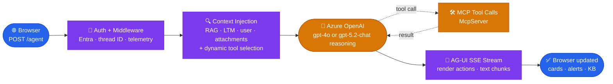

# HelpdeskAI.AgentHost

The backend Agent Host — an **ASP.NET Core (.NET 10)** web API that hosts the AI agent via the **AG-UI protocol**.

---

## What It Does

- **Hosts the AI agent** — AG-UI endpoint at `/agent` (v1 single agent) and `/agent/v2` (multi-agent handoff workflow via MAF)
- **Multi-agent workflow (v2)** — orchestrator routes to specialist agents (diagnostic, ticket, KB, incident) using MAF `HandoffsWorkflow`; each specialist has scoped MCP tools and context providers
- **Integrates Azure OpenAI** — v1 uses `gpt-4o` and v2 uses `gpt-5.2-chat` via an optional separate workflow deployment
- **Provides RAG context** — injects knowledge-base articles from Azure AI Search before each LLM call
- **Bridges to MCP tools** — connects to `HelpdeskAI.McpServer` for ticketing, system status monitoring, and KB search/index flows
- **Applies render-action guidance** — follows `_renderAction` / `_renderArgs` from MCP tool results so the frontend can render structured cards when appropriate
- **Validates Microsoft Entra bearer tokens** — `/agent` and frontend-facing API routes require a valid access token before user context is derived from claims
- **Persists long-term user memory** — profile facts and simple `remember that ...` preferences are stored in Redis and injected back into the prompt
- **Guards retry-safe side effects** — `create_ticket` and `index_kb_article` reuse prior thread-scoped results on immediate retries instead of duplicating writes
- **Proxies active incidents for the frontend shell** — authenticated `/api/incidents/active` enables the proactive incident banner without exposing McpServer directly
- **Captures turn-level telemetry** — repeated tool calls and latest user message are logged with per-turn scope data for Azure investigation
- **App Insights Agents (Preview)** — custom `ActivitySource` emits `invoke_agent` spans with `gen_ai.operation.name`, `gen_ai.agent.name`, `gen_ai.agent.id` semantic attributes for the Azure Monitor Agents preview view

---


## Configuration

### Example appsettings.json (do not use real secrets)

```json
{
  "AzureOpenAI": {
    "Endpoint": "<YOUR_AZURE_OPENAI_ENDPOINT>",
    "ApiKey": "<YOUR_AZURE_OPENAI_API_KEY>"
  },
  "AzureAISearch": {
    "Endpoint": "<YOUR_AZURE_AI_SEARCH_ENDPOINT>",
    "ApiKey": "<YOUR_AZURE_AI_SEARCH_API_KEY>"
  },
  "EntraAuth": {
    "TenantId": "<YOUR_ENTRA_TENANT_ID>",
    "ClientId": "<YOUR_ENTRA_APP_CLIENT_ID>",
    "Audience": "api://<YOUR_ENTRA_APP_CLIENT_ID>",
    "Authority": "https://login.microsoftonline.com/<YOUR_ENTRA_TENANT_ID>/v2.0"
  },
  "LongTermMemory": {
    "ProfileTtl": "90.00:00:00"
  },
  "ConnectionStrings": {
    "Redis": "localhost:6379"
  },
  "McpServer": {
    "Endpoint": "http://localhost:5100/mcp"
  }
}
```

For Azure deployment, set these values via Azure App Service/Container App settings or Key Vault. Never commit real secrets.
For local development, you can still run the app locally while pointing at Azure-hosted dependencies. The main extra requirement for Phase 2b is that the frontend and AgentHost must both be configured for the same Entra app registration and API audience.

> **Azure Container Apps — SSE session management:**
> Azure Container Apps hard-cuts HTTP/1.1 SSE streams at 240 seconds. The MCP client (`McpToolsProvider`)
> proactively reconnects every 3 minutes (well within that limit) and `RetryingMcpTool` catches transport
> errors mid-call to reconnect and retry once — ensuring long agentic conversations with many tool calls
> are never interrupted by Azure's ingress timeout.

> **Structured Audit Logging (Phase 1a):**
> Every `/agent` request opens a request-level `ILogger.BeginScope(new { threadId })` so all log lines
> during the turn carry `customDimensions.threadId` in App Insights. Every MCP tool call opens a
> tool-level scope (`toolName`) and logs `attempt`, `outcome`, and `durationMs` at Info/Warning/Error.
> Token counts per turn are emitted as structured traces (`PromptTokens`, `CompletionTokens`, `ThreadId`).
> These feed directly into the Phase 1d KQL baseline queries in `docs/baseline/kql-queries.md`.

> **Retry-Safe Writes (Phase 4a):**
> Thread-scoped Redis ledger entries now protect `create_ticket` and `index_kb_article` from duplicate
> writes during immediate retries or partial-workflow recovery. Reused results are returned in the same
> render-friendly shape as fresh tool responses, so the frontend card flow remains unchanged.

---
## Architecture

```mermaid
flowchart TD
    classDef browser fill:#2563eb,stroke:#1d4ed8,color:#fff
    classDef core    fill:#7c3aed,stroke:#6d28d9,color:#fff
    classDef ctx     fill:#5b21b6,stroke:#7c3aed,color:#fff
    classDef ep      fill:#1d4ed8,stroke:#2563eb,color:#fff
    classDef svc     fill:#d97706,stroke:#b45309,color:#fff
    classDef db      fill:#475569,stroke:#334155,color:#fff

    BROWSER(["🌐 Browser / Next.js"])

    subgraph AH["🤖  HelpdeskAI.AgentHost  ·  port 5200"]
        AGUI["📡 MapAGUI /agent<br/>AG-UI · SSE · Entra auth"]
        FI["⚙️ IChatClient Pipeline<br/>FunctionInvocationMiddleware"]
        MCP["🔧 McpToolsProvider<br/>+ RetryingMcpTool"]
        DTS["⚡ DynamicToolSelectionProvider<br/>TopK=8 · cosine similarity"]
        RAG["🔍 AzureAiSearchContextProvider"]
        LTM["🧠 LongTermMemoryContextProvider"]
        TG["🛡️ TurnGuardContextProvider"]
        UC["👤 UserContextProvider"]
        HIST["💾 RedisChatHistoryProvider"]
        ATT["📎 POST /api/attachments"]
        KB["🔎 GET /api/kb/search"]
        TKP["🎫 GET /api/tickets"]
    end

    MCPSRV(["🛠 McpServer  ·  port 5100"])
    AOA["☁️ Azure OpenAI<br/>gpt-4o · gpt-5.2-chat · embeddings"]
    AIS["🔍 Azure AI Search"]
    ABS["📦 Blob Storage"]
    ADI["📄 Document Intelligence"]
    REDIS[("💾 Redis")]

    BROWSER -->|POST /agent| AGUI
    BROWSER -->|POST /api/attachments| ATT
    BROWSER -->|GET /api/tickets| TKP

    AGUI --> FI
    AGUI --> HIST
    AGUI --> RAG
    AGUI --> LTM
    AGUI --> TG
    AGUI --> UC
    FI --> MCP
    FI --> DTS
    FI -->|chat completions| AOA
    MCP -->|MCP HTTP| MCPSRV
    DTS -->|embed query| AOA
    TKP -->|GET /tickets| MCPSRV
    RAG -->|semantic search| AIS
    KB -->|semantic search| AIS
    ATT -->|upload| ABS
    ATT -->|OCR| ADI
    ATT -->|staging| REDIS
    HIST -->|read/write| REDIS
    LTM -->|read/write| REDIS

    class BROWSER browser
    class AGUI,FI,MCP,DTS core
    class RAG,LTM,TG,UC ctx
    class ATT,KB,TKP ep
    class AOA,AIS,ABS,ADI svc
    class REDIS db
    class MCPSRV svc
```



---

## Quick Start

### 1. Configure & Start Redis

**For this demo (Windows with WSL):**
```bash
# In WSL terminal
redis-server
# → Running on localhost:6379
```

**Other platforms:**
- **macOS:** `brew install redis && redis-server`
- **Linux:** `sudo apt install redis-server && redis-server`
- **Windows (native):** Download from [GitHub](https://github.com/microsoftarchive/redis/releases) or use [Memurai](https://www.memurai.com)
- **Docker:** `docker run -d -p 6379:6379 --name redis redis:7-alpine`

> **Verify Redis:** `redis-cli ping` should return `PONG`

### 2. Configure

Create `appsettings.Development.json` at project root:

```json
{
  "AzureOpenAI": {
    "Endpoint": "https://<resource>.openai.azure.com/",
    "ApiKey": "<admin-key>",
    "ChatDeployment": "gpt-4o",
    "ChatDeploymentV2": "gpt-5.2-chat",
    "EmbeddingDeployment": "text-embedding-3-small"
  },
  "DynamicTools": {
    "TopK": 8
  },
  "AzureAISearch": {
    "Endpoint": "https://<search>.search.windows.net",
    "ApiKey": "<admin-key>",
    "IndexName": "helpdesk-kb",
    "TopK": 3
  },
  "McpServer": {
    "Endpoint": "http://localhost:5100/mcp"
  },
  "Conversation": {
    "SummarisationThreshold": 40,
    "TailMessagesToKeep": 5,
    "ThreadTtl": "30.00:00:00"
  }
}
```

> Leave `AzureAISearch.Endpoint` and `AzureAISearch.ApiKey` empty to skip RAG (agent still works).

### 3. Start MCP Server

In a separate terminal:
```bash
cd ../HelpdeskAI.McpServer
dotnet run
# → http://localhost:5100/mcp
```

### 4. Start Agent Host

```bash
dotnet run
# → http://localhost:5200
# AG-UI agent:  http://localhost:5200/agent
# Health check: http://localhost:5200/healthz
```

### 5. Start Frontend

In another terminal:
```bash
npm install
npm run dev
# → http://localhost:3000
```

---

## Configuration Reference

### `appsettings.Development.json` Structure

| Section | Key | Type | Required | Purpose |
|---------|-----|------|----------|---------|
| `AzureOpenAI` | `Endpoint` | string | ✅ | Azure OpenAI resource endpoint (ends with `/`) |
| `AzureOpenAI` | `ApiKey` | string | ✅ | Admin API key for Azure OpenAI |
| `AzureOpenAI` | `ChatDeployment` | string | ✅ | v1 chat model deployment name (e.g., `gpt-4o`) |
| `AzureOpenAI` | `ChatDeploymentV2` | string | | v2 workflow deployment name (e.g., `gpt-5.2-chat`); falls back to `ChatDeployment` if empty |
| `AzureOpenAI` | `EmbeddingDeployment` | string | ✅ | Embedding model deployment for dynamic tool selection (e.g., `text-embedding-3-small`) |
| `DynamicTools` | `TopK` | int | | Top-K tools to inject per turn via cosine similarity (default: `8`) |
| `AzureAISearch` | `Endpoint` | string | ❌ | Search service endpoint (leave empty to skip RAG) |
| `AzureAISearch` | `ApiKey` | string | ❌ | Search admin key |
| `AzureAISearch` | `IndexName` | string | | Index name (default: `helpdesk-kb`) |
| `AzureAISearch` | `TopK` | int | | Top-K results to inject (default: 3) |
| `EntraAuth` | `TenantId` | string | ✅ | Entra tenant for bearer-token validation |
| `EntraAuth` | `ClientId` | string | ✅ | API app registration client ID |
| `EntraAuth` | `Audience` | string | | Expected API audience, usually `api://<clientId>` |
| `EntraAuth` | `Authority` | string | | Token authority, defaults to the tenant v2 endpoint |
| `LongTermMemory` | `ProfileTtl` | timespan | | Retention for profile memory and remembered preferences |
| `McpServer` | `Endpoint` | string | | MCP server URL (default: `http://localhost:5100/mcp`) |
| `Conversation` | `SummarisationThreshold` | int | | Trigger summarization after N messages (default: 40) |
| `Conversation` | `TailMessagesToKeep` | int | | Keep last N messages verbatim when summarizing (default: 5) |
| `Conversation` | `ThreadTtl` | timespan | | Session expiry (default: 30 days) |
| `AzureBlobStorage` | `ConnectionString` | string | ❌ | Azure Storage connection string for attachment uploads |
| `AzureBlobStorage` | `ContainerName` | string | ❌ | Blob container (default: `helpdesk-attachments`) |
| `DocumentIntelligence` | `Endpoint` | string | ❌ | Azure Document Intelligence endpoint for PDF/DOCX OCR |
| `DocumentIntelligence` | `Key` | string | ❌ | Document Intelligence API key |

> **Attachment services are optional.** When `AzureBlobStorage` or `DocumentIntelligence` config is absent the `/api/attachments` endpoint returns a graceful error; all other agent functionality is unaffected.

### Getting Azure OpenAI Credentials

1. Go to **Azure Portal** → Azure OpenAI resource
2. Click **Keys and Endpoint** (left sidebar)
3. Copy:
   - **Endpoint** — the full URL (e.g., `https://my-oai.openai.azure.com/`)
   - **Key 1 or Key 2** — either works

### Getting Azure AI Search Credentials

1. Go to **Azure Portal** → Azure AI Search resource
2. Click **Keys** (left sidebar)
3. Copy:
   - **Endpoint** — the full URL (e.g., `https://my-search.search.windows.net`)
   - **Primary admin key** — paste as `ApiKey`

---

## Project Structure

```
HelpdeskAI.AgentHost/
├── Program.cs                      # ASP.NET Core startup, AG-UI mapping, CORS setup
├── appsettings.json                # Production defaults
├── appsettings.Development.json    # Local overrides (.gitignored)
├── Abstractions/
│   └── Abstractions.cs             # IContextProvider, AgentOptions, IBlobStorageService, IAttachmentStore interfaces
├── Agents/
│   ├── HelpdeskAgentFactory.cs          # Creates the v1 single agent (IChatClient pipeline)
│   ├── HelpdeskWorkflowFactory.cs       # Assembles the v2 multi-agent MAF handoff workflow
│   ├── OrchestratorAgentFactory.cs      # V2 orchestrator — routes to specialist agents
│   ├── DiagnosticAgentFactory.cs        # V2 specialist — attachment analysis, incident diagnosis
│   ├── TicketAgentFactory.cs            # V2 specialist — ticket creation, assignment, updates
│   ├── KBAgentFactory.cs               # V2 specialist — knowledge base search and indexing
│   ├── IncidentAgentFactory.cs          # V2 specialist — system status and incident checks
│   ├── FrontendToolForwardingProvider.cs # Captures CopilotKit frontend tools for v2 agents
│   ├── AzureAiSearchContextProvider.cs  # RAG injection before each LLM call
│   ├── AttachmentContextProvider.cs     # Injects staged attachment content (peek or clear mode)
│   ├── LongTermMemoryContextProvider.cs # Injects remembered profile facts and preferences
│   ├── TurnGuardContextProvider.cs      # Injects current-turn tool history for softer guardrails
│   ├── UserContextProvider.cs           # Injects authenticated user name and email from Entra headers
│   └── DynamicToolSelectionProvider.cs  # Per-turn cosine similarity tool selection via embeddings
├── Endpoints/
│   ├── AttachmentEndpoints.cs      # POST /api/attachments — upload, OCR, Blob staging
│   ├── EvalEndpoints.cs            # POST /agent/eval — synchronous eval endpoint for test harness
│   └── TicketEndpoints.cs          # GET /api/tickets — proxy to McpServer /tickets
├── Infrastructure/
│   ├── AGUIHistoryNormalizingClient.cs  # Merges consecutive assistant tool-call messages for OpenAI parallel tool-call compatibility
│   ├── AzureAiSearchService.cs          # Azure AI Search client wrapper (search + index)
│   ├── BlobStorageService.cs            # Azure Blob Storage — GUID-prefixed attachment uploads
│   ├── DocumentIntelligenceService.cs   # PDF/DOCX/image OCR via Azure Document Intelligence
│   ├── McpToolsProvider.cs              # Connects to McpServer at startup, loads and caches tools; RefreshAsync reconnects on session expiry
│   ├── RedisAttachmentStore.cs          # 1-hour one-shot staging store for attachments (load-and-clear on next turn)
│   ├── RedisChatHistoryProvider.cs      # Per-session chat history keyed by AG-UI threadId
│   ├── LongTermMemoryStore.cs           # Redis-backed user profile and preference memory
│   ├── RedisService.cs                  # Low-level IRedisService implementation (StringGet / StringSet / KeyDelete)
│   ├── RetryingMcpTool.cs               # DelegatingAIFunction wrapper — catches Session not found / transport errors, reconnects + retries once; emits structured audit traces (toolName, attempt, outcome, durationMs) picked up by Azure Monitor
│   ├── IncludeStreamingUsagePolicy.cs   # Azure SDK PipelinePolicy — injects stream_options:{include_usage:true} into streaming chat requests so Azure returns token counts in the final SSE chunk
│   ├── ThreadIdCapturingClient.cs       # AsyncLocal<string?> holder for AG-UI threadId; populated by request middleware
│   ├── TurnStateContext.cs              # AsyncLocal per-turn tool counters and latest user message
│   └── UsageCapturingChatClient.cs      # DelegatingChatClient — captures token usage from the final streaming chunk; writes usage:{threadId}:latest to Redis; emits structured traces (PromptTokens, CompletionTokens, ThreadId) for App Insights baseline queries
├── Models/
│   └── Models.cs                   # Config DTOs (AzureOpenAIOptions, AzureBlobStorageSettings, etc.)
└── HelpdeskAI.AgentHost.csproj     # Project file (.NET 10)
```

---

## How It Works

### Message Flow (one turn)



### RAG (Retrieval-Augmented Generation)

The `AzureAiSearchContextProvider` runs before every LLM invocation:

```csharp
public async Task<ChatOptions> ProvideAIContextAsync(...)
{
    // Query Azure AI Search for top-K results
    var results = await _searchService.SearchAsync(lastUserMessage);
    
    // Inject as system context
    var systemMsg = new ChatMessage(ChatRole.System, $"Context:\n{results}");
    chatOptions.Messages.Insert(0, systemMsg);
    
    return chatOptions;
}
```

If AI Search fails or is unconfigured, the context is skipped — the agent continues without it.

---

## API Endpoints

| Method | Path | Role |
|--------|------|------|
| `POST` | `/agent` | AG-UI v1 streaming endpoint — single agent (SSE) |
| `POST` | `/agent/v2` | AG-UI v2 streaming endpoint — multi-agent MAF workflow (SSE) |
| `POST` | `/agent/eval` | Synchronous eval endpoint for `HelpdeskAI.Evaluation` test harness — enabled for non-production environments only |
| `GET` | `/healthz` | Liveness / readiness probe (does not fail on Redis loss) |
| `GET` | `/agent/info` | Stack metadata — library names, runtime info |
| `GET` | `/agent/usage?threadId=` | Token usage for the most recent response — returns `{promptTokens, completionTokens}` from the thread-scoped Redis key written by `UsageCapturingChatClient` |
| `GET` | `/api/kb/search?q=...` | Knowledge base search (proxied from frontend `/api/kb`) |
| `POST` | `/api/attachments` | File upload — `.txt`, `.pdf`, `.docx` (OCR), `.png`/`.jpg`/`.jpeg` (vision) |
| `GET` | `/api/tickets` | Ticket list proxy → McpServer `/tickets` (supports `?requestedBy=`, `?status=`, `?category=`) |

### POST /agent (AG-UI)

**Input:** `RunAgentInput` (AG-UI protocol)
```json
{
  "sessionId": "user-session-id",
  "userInput": "Reset my password",
  "history": [...]
}
```

**Output:** Server-Sent Events (text/event-stream)
```
event: message_start
data: {...}

event: text_content
data: "Let me search for active tickets..."

event: function_call
data: {"name": "search_tickets", "arguments": {"status": "Open"}}

event: message_end
data: {...}
```

### GET /healthz

**Response:**
```json
{
  "status": "healthy",
  "timestamp": "2025-03-01T10:30:00Z",
  "checks": {
    "mcp_server": "connected",
    "ai_search": "connected | skipped",
    "azure_openai": "ready"
  }
}
```

---

## MCP Tools

The agent has access to these tools via MCP:

**Tickets:**
- `create_ticket` — create new support ticket
- `get_ticket` — retrieve ticket details with comments
- `search_tickets` — filter by email, status, category
- `update_ticket_status` — change ticket status with resolution
- `add_ticket_comment` — add public or internal comment
- `assign_ticket` — assign a ticket to an IT staff member

**System Status & Monitoring:**
- `get_system_status` — live IT services health check
- `get_active_incidents` — all active incidents with details
- `check_impact_for_team` — incidents affecting a specific team

**Knowledge Base:**
- `search_kb_articles` — search KB and return a single article card or related-article suggestions
- `index_kb_article` — save an incident resolution or document to Azure AI Search for future RAG retrieval

Current memory/guardrail scope:
- profile identity comes from the signed-in Entra user and is reinforced in Redis-backed long-term memory
- simple `remember that ...` preferences are persisted and injected through `## User Memory`
- turn-level tool history is surfaced to the model for softer guardrails and observability
- backend tool execution is still model-driven; repeated tool-loop prevention is intentionally not enforced via deterministic replay

See [src/HelpdeskAI.McpServer/README.md](../HelpdeskAI.McpServer/README.md) for full tool details.

For model-specific render-action behavior, see [docs/model-compatibility.md](../../docs/model-compatibility.md).

---

## Building for Production

### Backend Build

```bash
dotnet publish -c Release -o ./publish
```

Output lands in `publish/` ready for deployment (Docker, App Service, etc.).

### Frontend Build (Independent)

The Next.js frontend builds separately:

```bash
cd ../HelpdeskAI.Frontend
npm run build
# Output: .next/
```

Deploy frontend to Vercel, a static host, or a separate app service.

> **Note:** Backend and frontend are **independently deployable**. They communicate only via HTTP/CORS at the `/agent` endpoint.

### Docker Build

```dockerfile
FROM mcr.microsoft.com/dotnet/sdk:10.0 AS build
WORKDIR /src
COPY . .
RUN dotnet publish -c Release -o /app

FROM mcr.microsoft.com/dotnet/aspnet:10.0
WORKDIR /app
COPY --from=build /app .
EXPOSE 5200
CMD ["dotnet", "HelpdeskAI.AgentHost.dll"]
```

---

## Troubleshooting

### "Connection refused to localhost:5100"

**Symptom:** Error: `HttpRequestException: Connection refused`

**Fix:** MCP Server not running. Start it:
```bash
cd ../HelpdeskAI.McpServer && dotnet run
```

### "AI Search returns no results"

**Symptom:** Agent answers without showing KB context

**Fix:**
1. Verify `AzureAISearch.Endpoint` and `AzureAISearch.ApiKey` are filled in
2. Check the index exists: Azure Portal → AI Search → Indexes → `helpdesk-kb`
3. Check seed data was uploaded: view document count in the portal
4. Re-seed if needed:
   ```bash
   cd ../../../infra
   .\setup-search.ps1 -SearchEndpoint "..." -AdminKey "..."
   ```

### "Azure OpenAI 401 Unauthorized"

**Symptom:** `AuthorizationFailed` when calling LLM

**Fix:**
- Verify `ApiKey` from Azure Portal (Azure OpenAI → Keys and Endpoint)
- Ensure `Endpoint` ends with `/` (e.g., `https://my-oai.openai.azure.com/`)
- Check the key hasn't been rotated

### "appsettings.Development.json not found"

**Symptom:** Error: `FileNotFoundException`

**Fix:** Create the file at `src/HelpdeskAI.AgentHost/appsettings.Development.json` with your Azure credentials (see [Configuration Reference](#configuration-reference)).

### "npm: command not found"

**Symptom:** Error on `npm install`

**Fix:** 
- Install Node.js 22 LTS from https://nodejs.org
- Restart your terminal

---

## Key Dependencies

| Package | Version | Purpose |
|---------|---------|---------|
| `Microsoft.Extensions.AI` | 10.4.0 | `IChatClient`, `AIFunction`, `DelegatingAIFunction` |
| `Microsoft.Extensions.AI.OpenAI` | 10.4.0 | Azure OpenAI adapter (`AsIChatClient()`) |
| `Microsoft.Agents.AI.Hosting.AGUI.AspNetCore` | 1.0.0-preview.260311.1 | `MapAGUI()` SSE endpoint |
| `Microsoft.Agents.AI.OpenAI` | 1.0.0-rc4 | `AsAIAgent()`, `ChatHistoryProvider`, `AIContextProvider` |
| `ModelContextProtocol` | 1.1.0 | MCP client — `McpClientTool` implements `AIFunction` |
| `Azure.AI.OpenAI` | 2.8.0-beta.1 | `AzureOpenAIClient` |
| `Azure.AI.DocumentIntelligence` | 1.0.0 | PDF/DOCX OCR via Azure Document Intelligence |
| `Azure.Search.Documents` | 11.8.0-beta.1 | Semantic search / RAG |
| `Azure.Storage.Blobs` | 12.27.0 | Attachment archival to Blob Storage |
| `Azure.Identity` | 1.19.0 | `DefaultAzureCredential` (managed identity) |
| `Azure.Monitor.OpenTelemetry.AspNetCore` | 1.4.0 | Application Insights telemetry |
| `StackExchange.Redis` | 2.12.1 | Chat history + attachment staging |
| `AspNetCore.HealthChecks.Redis` | 9.0.0 | Redis health check package retained for future explicit probes; current `/healthz` does not fail on Redis loss |

---

## Learn More

- **Microsoft Agents SDK:** https://github.com/microsoft/agents-sdk
- **AG-UI Protocol:** https://aka.ms/ag-ui
- **Azure OpenAI:** https://learn.microsoft.com/azure/ai-services/openai/
- **Azure AI Search:** https://learn.microsoft.com/azure/search/
- **ASP.NET Core:** https://learn.microsoft.com/aspnet/core/
