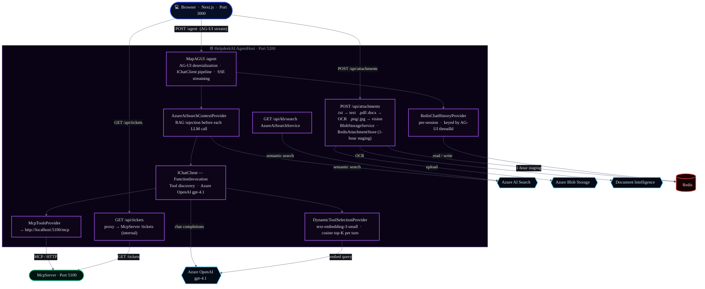

# HelpdeskAI.AgentHost

The backend Agent Host — an **ASP.NET Core (.NET 10)** web API that hosts the AI agent via the **AG-UI protocol**.

---

## What It Does

- **Hosts the AI agent** — AG-UI endpoint at `/agent` (Server-Sent Events streaming)
- **Integrates Azure OpenAI** — calls `gpt-4.1` for chat completions
- **Provides RAG context** — injects knowledge-base articles from Azure AI Search before each LLM call
- **Bridges to MCP tools** — connects to `HelpdeskAI.McpServer` for ticket management and system status monitoring

---


## Configuration

### Example appsettings.json (do not use real secrets)

```json
{
  "AzureOpenAI": {
    "Endpoint": "<YOUR_AZURE_OPENAI_ENDPOINT>",
    "ApiKey": "<YOUR_AZURE_OPENAI_API_KEY>"
  },
  "AzureAISearch": {
    "Endpoint": "<YOUR_AZURE_AI_SEARCH_ENDPOINT>",
    "ApiKey": "<YOUR_AZURE_AI_SEARCH_API_KEY>"
  },
  "ConnectionStrings": {
    "Redis": "localhost:6379"
  },
  "McpServer": {
    "Endpoint": "http://localhost:5100/mcp"
  }
}
```

For Azure deployment, set these values via Azure App Service/Container App settings or Key Vault. Never commit real secrets.

---
## Architecture



---

## Quick Start

### 1. Configure & Start Redis

**For this demo (Windows with WSL):**
```bash
# In WSL terminal
redis-server
# → Running on localhost:6379
```

**Other platforms:**
- **macOS:** `brew install redis && redis-server`
- **Linux:** `sudo apt install redis-server && redis-server`
- **Windows (native):** Download from [GitHub](https://github.com/microsoftarchive/redis/releases) or use [Memurai](https://www.memurai.com)
- **Docker:** `docker run -d -p 6379:6379 --name redis redis:7-alpine`

> **Verify Redis:** `redis-cli ping` should return `PONG`

### 2. Configure

Create `appsettings.Development.json` at project root:

```json
{
  "AzureOpenAI": {
    "Endpoint": "https://<resource>.openai.azure.com/",
    "ApiKey": "<admin-key>",
    "ChatDeployment": "gpt-4.1",
    "EmbeddingDeployment": "text-embedding-3-small"
  },
  "DynamicTools": {
    "TopK": 5
  },
  "AzureAISearch": {
    "Endpoint": "https://<search>.search.windows.net",
    "ApiKey": "<admin-key>",
    "IndexName": "helpdesk-kb",
    "TopK": 3
  },
  "McpServer": {
    "Endpoint": "http://localhost:5100/mcp"
  },
  "Conversation": {
    "SummarisationThreshold": 20,
    "TailMessagesToKeep": 6,
    "ThreadTtl": "30.00:00:00"
  }
}
```

> Leave `AzureAISearch.Endpoint` and `AzureAISearch.ApiKey` empty to skip RAG (agent still works).

### 3. Start MCP Server

In a separate terminal:
```bash
cd ../HelpdeskAI.McpServer
dotnet run
# → http://localhost:5100/mcp
```

### 4. Start Agent Host

```bash
dotnet run
# → http://localhost:5200
# AG-UI agent:  http://localhost:5200/agent
# Health check: http://localhost:5200/healthz
```

### 5. Start Frontend

In another terminal:
```bash
npm install
npm run dev
# → http://localhost:3000
```

---

## Configuration Reference

### `appsettings.Development.json` Structure

| Section | Key | Type | Required | Purpose |
|---------|-----|------|----------|---------|
| `AzureOpenAI` | `Endpoint` | string | ✅ | Azure OpenAI resource endpoint (ends with `/`) |
| `AzureOpenAI` | `ApiKey` | string | ✅ | Admin API key for Azure OpenAI |
| `AzureOpenAI` | `ChatDeployment` | string | ✅ | Chat model deployment name (e.g., `gpt-4.1`) |
| `AzureOpenAI` | `EmbeddingDeployment` | string | ✅ | Embedding model deployment for dynamic tool selection (e.g., `text-embedding-3-small`) |
| `DynamicTools` | `TopK` | int | | Top-K tools to inject per turn via cosine similarity (default: `5`) |
| `AzureAISearch` | `Endpoint` | string | ❌ | Search service endpoint (leave empty to skip RAG) |
| `AzureAISearch` | `ApiKey` | string | ❌ | Search admin key |
| `AzureAISearch` | `IndexName` | string | | Index name (default: `helpdesk-kb`) |
| `AzureAISearch` | `TopK` | int | | Top-K results to inject (default: 3) |
| `McpServer` | `Endpoint` | string | | MCP server URL (default: `http://localhost:5100/mcp`) |
| `Conversation` | `SummarisationThreshold` | int | | Trigger summarization after N messages (default: 20) |
| `Conversation` | `TailMessagesToKeep` | int | | Keep last N messages verbatim when summarizing (default: 6) |
| `Conversation` | `ThreadTtl` | timespan | | Session expiry (default: 30 days) |
| `AzureBlobStorage` | `ConnectionString` | string | ❌ | Azure Storage connection string for attachment uploads |
| `AzureBlobStorage` | `ContainerName` | string | ❌ | Blob container (default: `helpdesk-attachments`) |
| `DocumentIntelligence` | `Endpoint` | string | ❌ | Azure Document Intelligence endpoint for PDF/DOCX OCR |
| `DocumentIntelligence` | `Key` | string | ❌ | Document Intelligence API key |

> **Attachment services are optional.** When `AzureBlobStorage` or `DocumentIntelligence` config is absent the `/api/attachments` endpoint returns a graceful error; all other agent functionality is unaffected.
| `AzureBlobStorage` | `ConnectionString` | string | ❌ | Azure Storage connection string for attachment uploads |
| `AzureBlobStorage` | `ContainerName` | string | ❌ | Blob container name (default: `helpdesk-attachments`) |
| `DocumentIntelligence` | `Endpoint` | string | ❌ | Azure Document Intelligence endpoint for PDF/DOCX OCR |
| `DocumentIntelligence` | `Key` | string | ❌ | Document Intelligence API key |

> **Attachment services are optional.** When `AzureBlobStorage` or `DocumentIntelligence` config is absent the `/api/attachments` endpoint returns a graceful error; all other agent functionality is unaffected.

### Getting Azure OpenAI Credentials

1. Go to **Azure Portal** → Azure OpenAI resource
2. Click **Keys and Endpoint** (left sidebar)
3. Copy:
   - **Endpoint** — the full URL (e.g., `https://my-oai.openai.azure.com/`)
   - **Key 1 or Key 2** — either works

### Getting Azure AI Search Credentials

1. Go to **Azure Portal** → Azure AI Search resource
2. Click **Keys** (left sidebar)
3. Copy:
   - **Endpoint** — the full URL (e.g., `https://my-search.search.windows.net`)
   - **Primary admin key** — paste as `ApiKey`

---

## Project Structure

```
HelpdeskAI.AgentHost/
├── Program.cs                      # ASP.NET Core startup, AG-UI mapping, CORS setup
├── appsettings.json                # Production defaults
├── appsettings.Development.json    # Local overrides (.gitignored)
├── Abstractions/
│   └── Abstractions.cs             # IContextProvider, AgentOptions, IBlobStorageService, IAttachmentStore interfaces
├── Agents/
│   ├── HelpdeskAgentFactory.cs          # Creates the main agent (IChatClient pipeline)
│   ├── AzureAiSearchContextProvider.cs  # RAG injection before each LLM call
│   ├── AttachmentContextProvider.cs     # Injects staged attachment content into each turn
│   └── DynamicToolSelectionProvider.cs  # Per-turn cosine similarity tool selection via embeddings
├── Endpoints/
│   ├── AttachmentEndpoints.cs      # POST /api/attachments — upload, OCR, Blob staging
│   └── TicketEndpoints.cs          # GET /api/tickets — proxy to McpServer /tickets
├── Infrastructure/
│   ├── AzureAiSearchService.cs     # Search client wrapper
│   ├── BlobStorageService.cs       # Azure Blob Storage — GUID-prefixed uploads
│   ├── DocumentIntelligenceService.cs  # PDF/DOCX OCR via Azure Document Intelligence
│   ├── McpToolsProvider.cs         # Connects to MCP server, loads tools
│   ├── RedisChatHistoryProvider.cs # Per-session chat history (per AG-UI threadId)
│   └── RedisAttachmentStore.cs     # 1-hour staging store (load-and-clear on next turn)
├── Models/
│   └── Models.cs                   # Config DTOs (AzureOpenAIOptions, AzureBlobStorageSettings, etc.)
└── HelpdeskAI.AgentHost.csproj     # Project file (.NET 10)
```

---

## How It Works

### Message Flow (one turn)

```mermaid
%%{init: {"theme": "base", "themeVariables": {"primaryColor": "#151820", "primaryTextColor": "#e8eaf0", "primaryBorderColor": "#3d5afe", "lineColor": "#3d5afe", "secondaryColor": "#0f1117", "tertiaryColor": "#0a0b0f", "edgeLabelBackground": "#0f1117", "fontFamily": "system-ui, -apple-system, sans-serif"}}}%%
flowchart LR
    classDef endpoint fill:#080f24,stroke:#3d5afe,color:#e8eaf0,stroke-width:2px
    classDef step     fill:#0e0518,stroke:#a855f7,color:#e8eaf0,stroke-width:2px

    S1(["💻  Browser<br/>POST /agent"]):::endpoint
    S2["①  Deserialize<br/>RunAgentInput"]:::step
    S3["②  RAG + Tool Selection<br/>AI Search  ·  top-K KB context<br/>DynamicToolSelectionProvider  ·  cosine top-K tools"]:::step
    S4["③  LLM Reasoning<br/>Tool calls  ·  gpt-4.1 response"]:::step
    S5["④  SSE Stream<br/>TextMessageStart  ·  chunks  ·  ToolCall events"]:::step
    S6(["💻  Browser<br/>UI updated"]):::endpoint

    S1 --> S2 --> S3 --> S4 --> S5 --> S6
```



### RAG (Retrieval-Augmented Generation)

The `AzureAiSearchContextProvider` runs before every LLM invocation:

```csharp
public async Task<ChatOptions> ProvideAIContextAsync(...)
{
    // Query Azure AI Search for top-K results
    var results = await _searchService.SearchAsync(lastUserMessage);
    
    // Inject as system context
    var systemMsg = new ChatMessage(ChatRole.System, $"Context:\n{results}");
    chatOptions.Messages.Insert(0, systemMsg);
    
    return chatOptions;
}
```

If AI Search fails or is unconfigured, the context is skipped — the agent continues without it.

---

## API Endpoints

| Method | Path | Role |
|--------|------|------|
| `POST` | `/agent` | AG-UI streaming endpoint (SSE) |
| `GET` | `/healthz` | Liveness / readiness probe |
| `GET` | `/agent/info` | Stack metadata — library names, runtime info |
| `GET` | `/api/kb/search?q=...` | Knowledge base search (proxied from frontend `/api/kb`) |
| `POST` | `/api/attachments` | File upload — `.txt`, `.pdf`, `.docx` (OCR), `.png`/`.jpg`/`.jpeg` (vision) |
| `GET` | `/api/tickets` | Ticket list proxy → McpServer `/tickets` (supports `?requestedBy=`, `?status=`, `?category=`) |

### POST /agent (AG-UI)

**Input:** `RunAgentInput` (AG-UI protocol)
```json
{
  "sessionId": "user-session-id",
  "userInput": "Reset my password",
  "history": [...]
}
```

**Output:** Server-Sent Events (text/event-stream)
```
event: message_start
data: {...}

event: text_content
data: "Let me search for active tickets..."

event: function_call
data: {"name": "search_tickets", "arguments": {"status": "Open"}}

event: message_end
data: {...}
```

### GET /healthz

**Response:**
```json
{
  "status": "healthy",
  "timestamp": "2025-03-01T10:30:00Z",
  "checks": {
    "mcp_server": "connected",
    "ai_search": "connected | skipped",
    "azure_openai": "ready"
  }
}
```

---

## MCP Tools

The agent has access to these tools via MCP:

**Tickets:**
- `create_ticket` — create new support ticket
- `get_ticket` — retrieve ticket details with comments
- `search_tickets` — filter by email, status, category
- `update_ticket_status` — change ticket status with resolution
- `add_ticket_comment` — add public or internal comment

**System Status & Monitoring:**
- `get_system_status` — live IT services health check
- `get_active_incidents` — all active incidents with details
- `check_impact_for_team` — incidents affecting a specific team

See [src/HelpdeskAI.McpServer/README.md](../HelpdeskAI.McpServer/README.md) for full tool details.

---

## Building for Production

### Backend Build

```bash
dotnet publish -c Release -o ./publish
```

Output lands in `publish/` ready for deployment (Docker, App Service, etc.).

### Frontend Build (Independent)

The Next.js frontend builds separately:

```bash
cd ../HelpdeskAI.Frontend
npm run build
# Output: .next/
```

Deploy frontend to Vercel, a static host, or a separate app service.

> **Note:** Backend and frontend are **independently deployable**. They communicate only via HTTP/CORS at the `/agent` endpoint.

### Docker Build

```dockerfile
FROM mcr.microsoft.com/dotnet/sdk:10.0 AS build
WORKDIR /src
COPY . .
RUN dotnet publish -c Release -o /app

FROM mcr.microsoft.com/dotnet/aspnet:10.0
WORKDIR /app
COPY --from=build /app .
EXPOSE 5200
CMD ["dotnet", "HelpdeskAI.AgentHost.dll"]
```

---

## Troubleshooting

### "Connection refused to localhost:5100"

**Symptom:** Error: `HttpRequestException: Connection refused`

**Fix:** MCP Server not running. Start it:
```bash
cd ../HelpdeskAI.McpServer && dotnet run
```

### "AI Search returns no results"

**Symptom:** Agent answers without showing KB context

**Fix:**
1. Verify `AzureAISearch.Endpoint` and `AzureAISearch.ApiKey` are filled in
2. Check the index exists: Azure Portal → AI Search → Indexes → `helpdesk-kb`
3. Check seed data was uploaded: view document count in the portal
4. Re-seed if needed:
   ```bash
   cd ../../../infra
   .\setup-search.ps1 -SearchEndpoint "..." -AdminKey "..."
   ```

### "Azure OpenAI 401 Unauthorized"

**Symptom:** `AuthorizationFailed` when calling LLM

**Fix:**
- Verify `ApiKey` from Azure Portal (Azure OpenAI → Keys and Endpoint)
- Ensure `Endpoint` ends with `/` (e.g., `https://my-oai.openai.azure.com/`)
- Check the key hasn't been rotated

### "appsettings.Development.json not found"

**Symptom:** Error: `FileNotFoundException`

**Fix:** Create the file at `src/HelpdeskAI.AgentHost/appsettings.Development.json` with your Azure credentials (see [Configuration Reference](#configuration-reference)).

### "npm: command not found"

**Symptom:** Error on `npm install`

**Fix:** 
- Install Node.js 22 LTS from https://nodejs.org
- Restart your terminal

---

## Key Dependencies

| Package | Version | Purpose |
|---------|---------|---------|
| `Microsoft.Extensions.AI` | 10.3.0 | IChatClient, AIFunction |
| `Microsoft.Extensions.AI.OpenAI` | 10.3.0 | Azure OpenAI adapter |
| `Microsoft.Agents.AI.Hosting.AGUI.AspNetCore` | 1.0.0-preview | AG-UI hosting (`MapAGUI`) |
| `Azure.AI.OpenAI` | 2.8.0-beta.1 | Azure OpenAI SDK |
| `Azure.Search.Documents` | 11.8.0-beta.1 | AI Search client |
| `ModelContextProtocol` | 1.0.0 | MCP client |

---

## Learn More

- **Microsoft Agents SDK:** https://github.com/microsoft/agents-sdk
- **AG-UI Protocol:** https://aka.ms/ag-ui
- **Azure OpenAI:** https://learn.microsoft.com/azure/ai-services/openai/
- **Azure AI Search:** https://learn.microsoft.com/azure/search/
- **ASP.NET Core:** https://learn.microsoft.com/aspnet/core/
