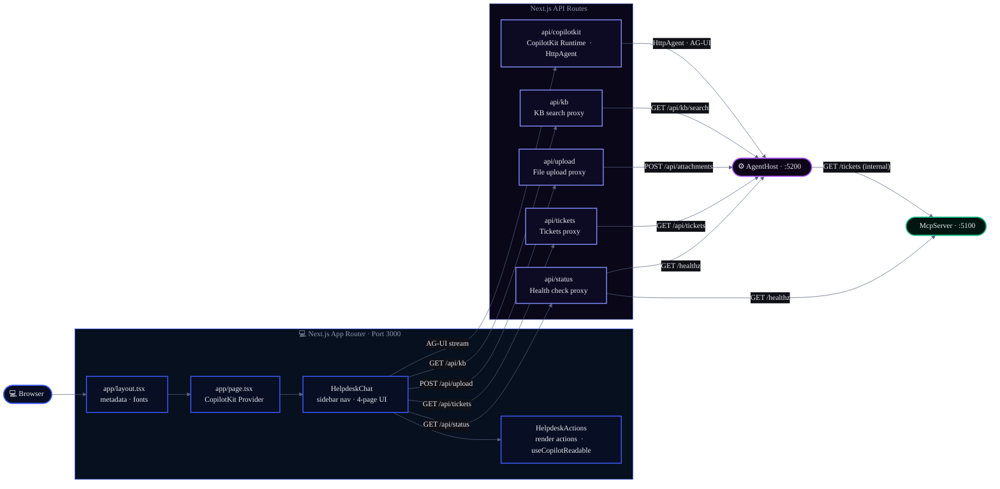

# HelpdeskAI — Frontend

A **React 19 + TypeScript** single-page application for the IT helpdesk AI agent. Built with **Next.js** (App Router) and powered by **CopilotKit** + AG-UI.

---

## What It Does

- **Real-time chat UI** — streams responses from the AI agent as they're generated
- **Rich render actions** — displays tickets, incidents, and search results as interactive cards
- **Response stats chip** — shows `⏱ Xs · 📥 N in / 📤 M out` in the header row (right-aligned) after each agent response; fetches token counts from `/api/copilotkit/usage`
- **Multi-page navigation** — IT Support chat, My Tickets tracker, Knowledge Base, Settings
- **Session management** — maintains conversation history and ticket state
- **Responsive design** — mobile-friendly, dark theme, keyboard accessible

---


## Configuration

### Example .env.local (do not use real secrets)

```
MCP_URL=http://localhost:5100/mcp
```

For Azure deployment, set these values via Azure App Service/Container App settings. Never commit real secrets.

---
## Quick Start

### Prerequisites

- **Node.js 22 LTS** — https://nodejs.org
- **Agent Host running** — `cd ../HelpdeskAI.AgentHost && dotnet run` (port 5200)

### Start Dev Server

```bash
npm install

# Windows — increase Node.js heap to avoid out-of-memory during type checking
$env:NODE_OPTIONS="--max-old-space-size=4096"

npm run dev
# → http://localhost:3000
```

### Build for Production

```bash
npm run build
# Output: .next/ + optimized bundle
```

The frontend and backend are independent. Run the Next.js dev server separately (`npm run dev` on port 3000) or deploy it independently.

---

## Project Structure

```
app/
├── layout.tsx                    # Root layout (metadata, fonts)
├── page.tsx                     # Home — CopilotKit provider + HelpdeskChat
├── globals.css                  # Global styles
├── next.config.ts               # Next.js configuration
├── api/
│   ├── copilotkit/
│   │   ├── route.ts             # CopilotKit Runtime → AG-UI backend
│   │   └── usage/
│   │       └── route.ts         # Token usage proxy → AgentHost /agent/usage
│   ├── kb/
│   │   └── route.ts             # KB search proxy  → AgentHost /api/kb/search
│   ├── tickets/
│   │   └── route.ts             # Tickets proxy    → McpServer /tickets (REST)
│   ├── status/
│   │   └── route.ts             # Health check     → McpServer + AgentHost /healthz
│   └── upload/
│       └── route.ts             # File upload      → AgentHost /api/attachments
components/
├── HelpdeskChat.tsx             # Main shell: sidebar nav, multi-page layout
├── HelpdeskActions.tsx          # Render actions: tickets, incidents, suggestions
lib/
└── constants.ts                 # Shared display maps (priority colours, category icons, health badges)
```

---

## Architecture



---

## Key Components

### `app/layout.tsx`

Root layout:
- Document metadata (`HelpdeskAI`)
- Font imports (DM Mono, Syne)
- Basic HTML structure

### `app/page.tsx`

App entry point:
- **CopilotKit Provider** — connects to `/api/copilotkit` runtime
- Specifies `agent="HelpdeskAgent"`
- Error boundary — suppresses browser extension noise
- Renders `HelpdeskChat` component

### `components/HelpdeskChat.tsx`

Main UI shell:
- **Sidebar navigation** — 4 pages (Chat, Tickets, Knowledge Base, Settings)
- **Page router** — switches between pages on nav click
- **Chat page** — hosts `CopilotChat` component + `HelpdeskActions`
- **Tickets page** — displays user's created tickets with status badges
- **Knowledge Base page** — live search via `/api/kb?q=...`; renders `KbArticleCard` results sourced from Azure AI Search
- **Settings page** — pings `/api/status`; renders green/red health indicators for McpServer + AgentHost
- **Response stats chip** — after each response, fetches token usage from `/api/copilotkit/usage?threadId=` and renders a `⏱ Xs · 📥 N in / 📤 M out` chip in the header row (right-aligned, monospace); uses a `fetchStatsRef` pattern to avoid stale closures across re-renders
- **Styling** — CopilotKit CSS variable overrides for dark theme

### `components/HelpdeskActions.tsx`

Copilot integration layer:
- **`useCopilotReadable()`** — exposes user context and ticket list to agent
- **Render actions** — 7 custom components rendered by the agent:
  - `show_ticket_created` — ticket confirmation card (after `create_ticket`)
  - `show_incident_alert` — incident/outage alert card (after `get_active_incidents` / `get_system_status`)
  - `show_my_tickets` — ticket search results list (after `search_tickets`)
  - `show_ticket_details` — full ticket detail card (after `get_ticket`; agent must call `get_ticket` first and pass all fields)
  - `show_kb_article` — knowledge base article card
  - `suggest_related_articles` — 2–3 related article suggestions
  - `show_attachment_preview` — document preview card (after processing an `## Attached Document`)
- **Chat suggestions** — `useCopilotChatSuggestions()` for follow-up prompts

---

## CopilotKit Integration

### CopilotChat Component

From `@copilotkit/react-ui` — handles message UI, input field, and streaming:

```typescript
<CopilotChat
  instructions={String}  // System prompt / agent instructions
  labels={{
    title: string,       // Header title
    initial: string,     // Welcome message
    placeholder: string, // Input placeholder
  }}
/>
```

Provider configuration in `app/page.tsx`:
```typescript
<CopilotKit
  runtimeUrl="/api/copilotkit"  // Next.js API endpoint
  agent="HelpdeskAgent"           // Agent ID to invoke
  onError={(event) => {...}}      // Error handler
>
```

---

## Configuration

### Environment Variables

Set in `.env.local`:

| Variable | Default | Purpose |
|----------|---------|----------|
| `AGENT_URL` | `http://localhost:5200/agent` | Includes `/agent` suffix — used by the copilotkit route **only** |
| `AGENT_BASE_URL` | `http://localhost:5200` | No `/agent` suffix — used by `/api/kb`, `/api/status`, and `/api/tickets` |
| `MCP_URL` | `http://127.0.0.1:5100` | McpServer base URL — used by `/api/status` only (tickets now proxied via AgentHost) |

For production, update `next.config.ts`:
```typescript
env: {
  AGENT_URL:      process.env.AGENT_URL      ?? "https://api.helpdeskai.example.com/agent",
  AGENT_BASE_URL: process.env.AGENT_BASE_URL ?? "https://api.helpdeskai.example.com",
  MCP_URL:        process.env.MCP_URL        ?? "https://mcp.helpdeskai.example.com",
}
```

---

## Building & Deployment

### Development

```bash
npm run dev
# Hot reload on file changes, with Turbopack
# http://localhost:3000
```

### Production Build

```bash
npm run build
npm start
# Optimized production server on port 3000
```

Or let the backend serve it:
- Copy `.next` output to backend static folder
- Configure backend to serve Next.js as static content

---

## Styling

**Global CSS** via `app/globals.css` + **CopilotKit CSS variables**:

```css
/* app/globals.css */
body { /* ... */ }
a { /* ... */ }
```

Theme customization in `HelpdeskChat.tsx`:
```typescript
const ckTheme: CopilotKitCSSProperties = {
  "--copilot-kit-primary-color": "#3d5afe",        // Blue
  "--copilot-kit-background-color": "#0a0b0f",      // Dark
  // ... (see component for full list)
};
```

Key styles:
- **Dark theme** — blue primary, dark grays
- **Sidebar nav** — fixed left panel with page buttons
- **Card components** — ticket and incident cards with colored left borders
- **Responsive** — mobile-first, flexbox layout

---

## Dependencies

| Package | Version | Purpose |
|-----------|---------|----------|
| `react` | 19.2.4 | UI framework |
| `react-dom` | 19.2.4 | React DOM renderer |
| `next` | 16.1.6 | Framework (app router, SSR, static generation) |
| `@copilotkit/react-core` | 1.54.0 | CopilotKit provider and hooks |
| `@copilotkit/react-ui` | 1.54.0 | CopilotKit UI components (CopilotChat) |
| `@copilotkit/runtime` | 1.54.0 | CopilotKit runtime integration |
| `@ag-ui/client` | 0.0.47 | `HttpAgent` (AG-UI protocol) |
| `@ag-ui/core` | 0.0.47 | AG-UI types and utilities |
| `typescript` | 5.9.3 | Type checking (devDependency) |

---

## Troubleshooting

### "Cannot find module '@copilotkit/react-core'"

**Fix:**
```bash
rm -r node_modules .next
npm cache clean --force
npm install
```

### "Next.js dev server won't start"

**Fix:** Ensure Agent Host is running on port 5200:
```bash
cd ../HelpdeskAI.AgentHost
dotnet run
```

### `AGENT_URL` vs `AGENT_BASE_URL` — 404 on KB / Settings pages

**Symptom:** Knowledge Base search or Settings health panel returns 502 or 404.

**Cause:** Two separate env vars control routing:
- `AGENT_URL` — must include the `/agent` suffix; used **only** by `app/api/copilotkit/route.ts`
- `AGENT_BASE_URL` — must **not** include `/agent`; used by `app/api/kb/route.ts` and `app/api/status/route.ts`

**Fix:** Ensure both are set correctly in `.env.local`:
```
AGENT_URL=http://localhost:5200/agent
AGENT_BASE_URL=http://localhost:5200
MCP_URL=http://127.0.0.1:5100
```

### "Chat responses not streaming"

**Symptom:** Loading spinner spins forever

**Fix:**
1. Verify Agent Host is running: `cd ../HelpdeskAI.AgentHost && dotnet run`
2. Open DevTools → Network → filter copilotkit
3. Check POST to `/api/copilotkit`
4. If 502 or connection refused, Agent Host backend is down
5. If request succeeds, check Console for JS errors

---

## Learn More

- **Next.js Docs:** https://nextjs.org/docs
- **React Docs:** https://react.dev
- **CopilotKit Docs:** https://docs.copilotkit.ai
  - CopilotChat component
  - useCopilotReadable hook
  - useCopilotAction hook
  - useCopilotChatSuggestions hook
- **AG-UI Protocol:** https://aka.ms/ag-ui
- **Backend Agent:** See `../HelpdeskAI.AgentHost`
