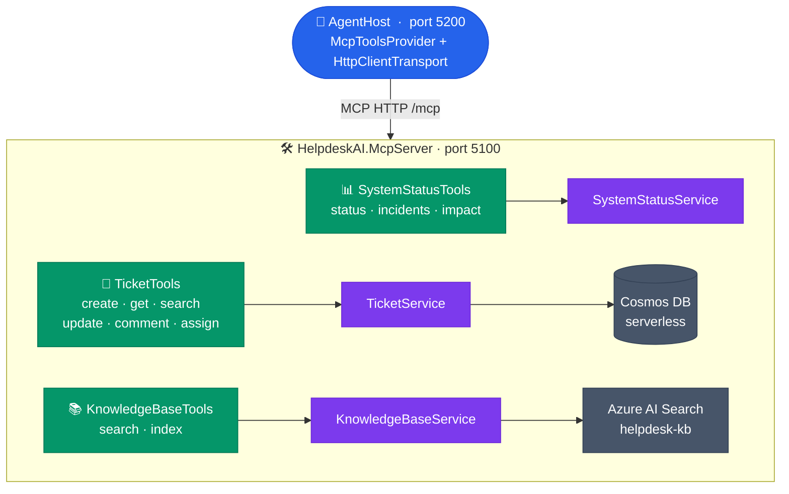

# HelpdeskAI.McpServer

An **ASP.NET Core (.NET 10)** Model Context Protocol (MCP) server that exposes IT helpdesk tools for the AI agent to discover and invoke.

---

## What It Does

Hosts **11 MCP tools** over HTTP at `/mcp` in three categories:

**Ticket Management (6 tools):**
- Create support tickets
- Retrieve ticket details with comments
- Search and filter tickets by email/status/category
- Update ticket status with resolution notes
- Add public or internal comments
- Assign tickets to IT staff members

**System Status & Monitoring (3 tools):**
- Check live health of IT services with incident details
- View all active infrastructure incidents with workarounds
- Get incident impact analysis for specific teams

**Knowledge Base (2 tools):**
- Search KB articles with render-friendly results
- Index incident resolutions and documents into Azure AI Search, with same-topic reuse/refresh behavior to reduce duplicate articles

---


## Configuration

### Configuration Keys

| Section | Key | Description |
|---------|-----|-------------|
| `AzureAISearch` | `Endpoint`, `ApiKey`, `IndexName`, `TopK` | Azure AI Search for KB articles |
| `CosmosDb` | `Endpoint`, `PrimaryKey`, `DatabaseName`, `ContainerName` | Cosmos DB for ticket persistence |
| — | `APPLICATIONINSIGHTS_CONNECTION_STRING` | Azure Monitor / App Insights |

**Local dev:** `appsettings.Development.json` (written automatically by `infra/deploy.ps1`, gitignored).

**Azure (Container App):** env vars injected by `deploy.ps1` via `az containerapp update`.

Local development can also run the server against Azure-hosted Cosmos DB and Azure AI Search directly; a separate local sandbox is not required.

Example `appsettings.json` shape (no real secrets):

```json
{
  "AzureAISearch": {
    "Endpoint": "<SEARCH_ENDPOINT>",
    "ApiKey": "<SEARCH_KEY>",
    "IndexName": "helpdesk-kb",
    "TopK": 3
  },
  "CosmosDb": {
    "Endpoint": "<COSMOS_ENDPOINT>",
    "PrimaryKey": "<COSMOS_KEY>",
    "DatabaseName": "helpdeskdb",
    "ContainerName": "tickets"
  },
  "APPLICATIONINSIGHTS_CONNECTION_STRING": "<APPINSIGHTS_CS>"
}
```

Never commit real secrets — `appsettings.Development.json` is in `.gitignore`.

The Azure AI Search index shape now includes `tags` and `indexedAt`; `indexedAt` is used by latest-article browse flows in AgentHost.

---
## Quick Start

### Prerequisites

- **.NET 10 SDK** — https://dot.net/download

### Start the Server

```bash
dotnet run
# → http://localhost:5100/mcp
```

Verify it's running:
```bash
curl http://localhost:5100/healthz
```

Response:
```json
{
  "status": "healthy",
  "timestamp": "2025-03-01T10:30:00Z"
}
```

---

## Architecture



---

## REST Endpoints

In addition to MCP tools, the server exposes a plain HTTP endpoint for the frontend proxy:

| Method | Path | Description |
|--------|------|-------------|
| `GET/POST` | `/mcp` | MCP tool discovery + invocation |
| `GET` | `/tickets` | JSON list of tickets — **internal-only** (consumed by AgentHost `GET /api/tickets` proxy; not browser-facing) — supports `?requestedBy=`, `?status=`, `?category=` |
| `GET` | `/healthz` | Liveness probe |

---

## Tools Reference

The server exposes **11 MCP tools** in three categories:

### Ticket Management (6 tools)

#### `create_ticket`

Create a new IT support ticket.

**Parameters:**
```typescript
{
  title: string                    // Short title (max 80 chars)
  description: string              // Full description including error messages and steps tried
  priority?: "Low" | "Medium" | "High" | "Critical"  // defaults to "Medium"
  category: "Hardware" | "Software" | "Network" | "Access" | "Email" | "VPN" | "Other"
  requestedBy: string              // User's email address
}
```

**Returns:** Full ticket JSON (same shape as `get_ticket`, minus comments)
```json
{
  "id": "INC-1004", "title": "VPN Connection Issues", "status": "open",
  "priority": "high", "category": "network", "description": "...",
  "requestedBy": "user@contoso.com", "assignedTo": null, "createdAt": "..."
}
```

#### `get_ticket`

Get full ticket details including all comments.

**Parameters:**
```typescript
{
  ticketId: string  // e.g., "INC-1001"
}
```

**Returns:** Full ticket with metadata and comments
```
INC-1001 - Cannot login to network
Status: Open | Priority: High | Category: Access
Requested by: john@example.com | Assigned: Unassigned
Comments:
  [3/1/2025 10:30 AM] Sarah (IT): Have you tried clearing browser cache?
```

#### `search_tickets`

Search and filter tickets.

**Parameters:**
```typescript
{
  requestedBy?: string    // Filter by email
  status?: string         // Open | InProgress | PendingUser | Resolved | Closed
  category?: string       // Hardware | Software | Network | Access | Email | VPN | Other
}
```

**Returns:** List of matching tickets (up to 15)
```
Found 3:
  INC-1001 | Open         | High     | Cannot login to network
  INC-1002 | InProgress   | Critical | Printer not responding
  INC-1003 | Resolved     | Medium   | Email sync issues
```

#### `update_ticket_status`

Update ticket status. Resolution note required for Resolved/Closed.

**Parameters:**
```typescript
{
  ticketId: string
  newStatus: "Open" | "InProgress" | "PendingUser" | "Resolved" | "Closed"
  resolution?: string     // Required if status is Resolved or Closed
}
```

**Returns:** Confirmation
```
INC-1001 updated to Resolved. Resolution: Reset password and cleared browser cache. User confirmed working.
```

#### `add_ticket_comment`

Add a public or internal comment to a ticket.

**Parameters:**
```typescript
{
  ticketId: string
  author: string                    // Commenter email/name
  message: string                   // Comment text
  isInternal?: boolean              // true = IT staff only, false = user-visible (default: false)
}
```

**Returns:** Confirmation
```
Comment added to INC-1001. Total comments: 5
```

#### `assign_ticket`

Assign a ticket to an IT staff member.

**Parameters:**
```typescript
{
  ticketId: string    // e.g., "INC-1001"
  assignee: string    // IT staff email or display name
}
```

**Returns:** Confirmation
```
INC-1001 assigned to sarah.it@contoso.com
```

### System Status (3 tools)

These tools provide real-time IT infrastructure and service health status.

#### `get_system_status`

Checks the live health of IT services and infrastructure. Returns operational status, incident IDs, and estimated resolution times.

**Parameters:**
```typescript
{
  service?: string        // Service name or keyword e.g. "VPN", "Teams", "email" (optional)
  category?: string       // Filter by category: Network | Email | Collaboration | DevTools | Business | Identity | Endpoint
  incidentsOnly?: boolean // Return only services with active incidents (default: false)
}
```

**Returns:** Formatted status table
```
IT System Status  Fri, 01 Mar 2025 10:30:00 +0000
----------------------------------------------------
[OK] Microsoft Exchange Online [Email]
[DEGRADED] Microsoft Teams [Collaboration]
  > Intermittent call drops in APAC region.
  > Incident INC-9041 | Started: 8:30 AM UTC | ETA: 11:30 AM UTC
[OUTAGE] VPN Gateway (Kolkata) [Network]
  > Primary gateway offline. Failover in progress.
  > Incident INC-9055 | Started: 9:45 AM UTC | ETA: 12:45 PM UTC
----------------------------------------------------
12 service(s) checked  3 active incident(s)
```

#### `get_active_incidents`

Returns all active IT incidents with impact description, affected teams, workarounds, and resolution ETAs. Use when you need the full incident picture.

**Parameters:** None

**Returns:** Detailed incident report
```
Active IT Incidents (3)  Fri, 01 Mar 2025 10:30:00 +0000
============================================================

[DEGRADED] Microsoft Teams
  Incident ID : INC-9041
  Category    : Collaboration
  Started     : 8:30 AM UTC (120 min ago)
  ETA         : 11:30 AM UTC
  Impact      : Intermittent call drops in APAC region.
  Affects     : Engineering, Product, Sales
  Workaround  : Use Teams web app at teams.microsoft.com or dial via phone audio.

[OUTAGE] VPN Gateway (Kolkata)
  Incident ID : INC-9055
  Category    : Network
  Started     : 9:45 AM UTC (45 min ago)
  ETA         : 12:45 PM UTC
  Impact      : Primary gateway offline. Failover in progress.
  Affects     : Engineering, Finance, HR
  Workaround  : Connect to vpn2.contoso.com (secondary gateway) instead.

============================================================
For live updates, visit: https://status.contoso.com
```

#### `check_impact_for_team`

Given a team or department name, returns all active incidents affecting them with workarounds.

**Parameters:**
```typescript
{
  team: string           // Team/department name e.g. "Engineering", "Finance", "Product", or "All"
}
```

**Returns:** Team-specific incident summary
```
Active incidents affecting: Engineering
----------------------------------------------------
[DEGRADED] Microsoft Teams
  Intermittent call drops in APAC region.
  Workaround: Use Teams web app at teams.microsoft.com or dial via phone audio.
  ETA: 11:30 AM UTC

[OUTAGE] VPN Gateway (Kolkata)
  Primary gateway offline. Failover in progress.
  Workaround: Connect to vpn2.contoso.com (secondary gateway) instead.
  ETA: 12:45 PM UTC

----------------------------------------------------
2 incident(s) found. Raise a ticket if workarounds are insufficient.
```

---

### Knowledge Base (2 tools)

#### `search_kb_articles`

Searches Azure AI Search for one or more relevant KB articles and returns either a single strong match or a shortlist suitable for related-article suggestions.

**Parameters:**
```typescript
{
  query: string        // Search query or issue summary
}
```

**Returns:** A KB article payload or a related-articles shortlist for the frontend render flow.

Search results now include lightweight `matchQuality` hints so the UI can distinguish a strong match from a merely related article without changing the overall render flow.

#### `index_kb_article`

Saves a document or incident resolution to the IT knowledge base (Azure AI Search) so it can be found in future RAG queries.

**Parameters:**
```typescript
{
  title:    string   // Short descriptive title (max 100 chars)
  content:  string   // Full content — troubleshooting steps, resolution, or reference material
  category?: string  // VPN | Email | Hardware | Network | Access | Printing | Software | Other
}
```

**Returns:** KB article result. The service now prefers:
- reusing an exact existing article when title/content/category already match
- refreshing an existing article when the same topic is found with improved content
- creating a new article only when no strong same-topic match exists

The result payload also includes:
- `disposition` — `created` | `reused` | `refreshed`
- `matchQuality` — lightweight quality signal for the resulting KB article

Example:
```
KB article already existed for this topic. Refreshed article ID: KB-up-abc123.
```

> **Requires Azure AI Search** — configures via `AzureAISearch.Endpoint` + `AzureAISearch.ApiKey` in `appsettings.Development.json` on the **AgentHost** side. The MCP server's `KnowledgeBaseSettings` section must also point to the same Search endpoint.

---

## Enumerations

**Ticket Management:**

| Enum | Values |
|------|--------|
| `TicketPriority` | Low, Medium, High, Critical |
| `TicketStatus` | Open, InProgress, PendingUser, Resolved, Closed |
| `TicketCategory` | Hardware, Software, Network, Access, Email, VPN, Other |

**System Status:**

| Enum | Values | Meaning |
|------|--------|---------|
| `ServiceHealth` | Operational | Service running normally ✅ |
| | Degraded | Service experiencing partial issues ⚠️ |
| | Outage | Service completely unavailable 🔴 |
| | Maintenance | Scheduled maintenance in progress 🔧 |

---

## Seed Data

### Ticket Categories

- **Hardware**: Desktop, laptop, monitors, printers, peripherals
- **Software**: Application errors, installation, licensing, compatibility
- **Network**: Connectivity, VPN, bandwidth, DNS issues
- **Access**: Permissions, login failures, account lockouts, SSO
- **Email**: Exchange issues, Outlook sync, calendar, distribution lists
- **VPN**: Connection failures, slowness, gateway issues, geographic access
- **Other**: Miscellaneous IT requests

### System Services & Status

**12 services** are pre-seeded with realistic status, incidents, and workarounds:

| Service | Category | Status | Incident |
|---------|----------|--------|----------|
| Microsoft Exchange Online | Email | ✅ Operational | — |
| Microsoft Teams | Collaboration | ⚠️ Degraded | Intermittent call drops in APAC |
| Microsoft SharePoint | Collaboration | ✅ Operational | — |
| Entra ID (Azure AD) | Identity | ✅ Operational | — |
| VPN Gateway (Kolkata) | Network | 🔴 Outage | Primary gateway offline, failover in progress |
| VPN Gateway (Global) | Network | ✅ Operational | — |
| GitHub Enterprise | DevTools | ✅ Operational | — |
| Azure DevOps | DevTools | 🔧 Maintenance | Scheduled infrastructure upgrades |
| Wi-Fi Network | Network | ✅ Operational | — |
| Intune Device Management | Endpoint | ✅ Operational | — |
| SAP ERP System | Business | ⚠️ Degraded | Module performance issues, rolling restart in progress |
| Salesforce CRM | Business | ✅ Operational | — |

**Key Incident Details:**

| Service | INC ID | Started | ETA | Affects | Workaround |
|---------|--------|---------|-----|---------|-----------|
| Microsoft Teams | INC-9041 | 8:30 AM (120 min ago) | 11:30 AM UTC | Engineering, Product, Sales | Use Teams web app (teams.microsoft.com) or phone audio dial-in |
| VPN (Kolkata) | INC-9055 | 9:45 AM (45 min ago) | 12:45 PM UTC | Engineering, Finance, HR | Connect to vpn2.contoso.com secondary gateway |
| SAP ERP | INC-9067 | 7:15 AM (195 min ago) | 1:00 PM UTC | Finance, HR, Operations | Use batch processing for non-urgent transactions; direct queries to read replicas |

### Sample Tickets

| ID | Title | Priority | Status | Category |
|----|-------|----------|--------|----------|
| INC-1001 | Cannot login to network | High | Open | Access |
| INC-1002 | Printer not responding | Critical | InProgress | Hardware |
| INC-1003 | Email sync issues | Medium | Resolved | Email |

Seed data is written to Cosmos DB on the **first startup only** (when the container is empty). Subsequent restarts skip seeding and restore the ID counter from `MAX(c.seq)`.

---

## Configuration

The server requires `appsettings.Development.json` for local development (written by `infra/deploy.ps1`).
It listens on `http://localhost:5100`, exposes MCP tools at `/mcp`, and connects to Azure Cosmos DB.

On **first startup** against an empty Cosmos container, 13 realistic seed tickets are written automatically.
Subsequent restarts skip seeding and resume from where the ID counter left off.

### Environment Variables

| Variable | Default | Purpose |
|----------|---------|---------|
| `ASPNETCORE_URLS` | `http://localhost:5100` | Server bind URL |
| `ASPNETCORE_ENVIRONMENT` | `Development` | ASP.NET environment |
| `CosmosDb__Endpoint` | _(required)_ | Cosmos DB account endpoint URL |
| `CosmosDb__PrimaryKey` | _(required)_ | Cosmos DB primary master key |
| `CosmosDb__DatabaseName` | `helpdeskdb` | Database name |
| `CosmosDb__ContainerName` | `tickets` | Container name (partition key: `/id`) |

---

## Project Structure

```
HelpdeskAI.McpServer/
├── Program.cs                  # ASP.NET Core startup, MCP mapping
├── appsettings.json            # Configuration defaults
├── Models/
│   └── Ticket.cs               # Ticket DTO
├── Services/
│   ├── KnowledgeBaseService.cs # Azure AI Search client — writes KB articles via index_kb_article
│   └── TicketService.cs        # Cosmos DB ticket store — serverless, durable across restarts
├── Tools/
│   ├── KnowledgeBaseTools.cs   # index_kb_article — indexes docs/resolutions into Azure AI Search
│   ├── TicketTools.cs          # Ticket management MCP tools (create · get · search · update · comment · assign)
│   └── SystemStatusTools.cs    # System health tools (get_system_status · get_active_incidents · check_impact_for_team)
├── HelpdeskAI.McpServer.csproj # Project file (.NET 10)
└── Properties/
    └── launchSettings.json     # Debug launch configuration
```

---

## API Endpoints

### POST/GET /mcp

MCP protocol endpoint for tool discovery and invocation.

**Request (tool discovery):**
```json
{
  "jsonrpc": "2.0",
  "id": "tools/list",
  "method": "tools/list"
}
```

**Response:**
```json
{
  "jsonrpc": "2.0",
  "result": {
    "tools": [
      {
        "name": "create_ticket",
        "description": "Create a new support ticket",
        "inputSchema": { ... }
      },
      ...
    ]
  }
}
```

### GET /healthz

Health check endpoint.

**Response:**
```json
{
  "status": "healthy",
  "timestamp": "2025-03-01T10:30:00Z"
}
```

---

## Production Deployment

Tickets are now persisted in **Azure Cosmos DB** (serverless tier) — no data loss on Container App restarts.

For production ITSM integration, replace the Cosmos-backed `TicketService` with calls to your actual system:

### Supported Backends

- **ServiceNow** — via official REST API
- **Jira** — via Jira REST API
- **Azure DevOps** — via Azure DevOps REST API

### Changes Required

Edit `Services/TicketService.cs`:

```csharp
// Replace in-memory ConcurrentDictionary with API calls

public class TicketService
{
    private readonly IServiceNowClient _serviceNow;
    
    public async Task<Ticket> CreateTicketAsync(CreateTicketRequest req)
    {
        // Call ServiceNow REST API
        return await _serviceNow.CreateTicket(req);
    }
    
    // ... implement other methods
}
```

Register the new service in `Program.cs`:

```csharp
builder.Services.AddScoped<ITicketProvider>(sp => 
    new ServiceNowTicketProvider(serviceNowApiUrl, apiKey));
```

---

## Security Considerations

### Current (Development)

- ⚠️ Public HTTP access on `/mcp` — no authentication
- ⚠️ No authentication required
- ⚠️ No rate limiting
- ⚠️ Tool execution is still optimized for the trusted internal AgentHost caller, not general public exposure

### Production Recommendations

- Add API key authentication on `/mcp` endpoint
- Use HTTPS (TLS)
- Implement rate limiting (e.g., via middleware)
- Add request logging for audit trail
- Validate all input parameters
- Implement circuit breaker for backend ITSM system

Example: Add API key middleware

```csharp
app.Use(async (context, next) =>
{
    if (context.Request.Path.StartsWithSegments("/mcp"))
    {
        if (!context.Request.Headers.TryGetValue("X-API-Key", out var key) || 
            key != validApiKey)
        {
            context.Response.StatusCode = 401;
            return;
        }
    }
    await next();
});
```

---

## Troubleshooting

### "Connection refused to localhost:5100"

**Symptom:** Agent Host shows connection error

**Fix:** Ensure MCP Server is running:
```bash
cd src/HelpdeskAI.McpServer
dotnet run
# Should show: "Now listening on: http://localhost:5100"
```

### "MCP tools not available to agent"

**Symptom:** Agent doesn't show tool options

**Fix:**
1. Verify MCP Server is running and healthy: `curl http://localhost:5100/healthz`
2. Check Agent Host logs for MCP connection errors
3. Verify `McpServer.Endpoint` in `appsettings.Development.json` is correct

### "Cannot create ticket / Tool invocation fails"

**Symptom:** Tool call returns error

**Fix:**
1. Check Server logs for detailed error message
2. Verify all required parameters are provided
3. Ensure parameter types match schema (e.g., priority is one of the valid enum values)

---

## Learn More

- **Model Context Protocol:** https://modelcontextprotocol.io
- **MCP .NET SDK:** https://github.com/modelcontextprotocol/csharp-sdk
- **ASP.NET Core:** https://learn.microsoft.com/aspnet/core/
